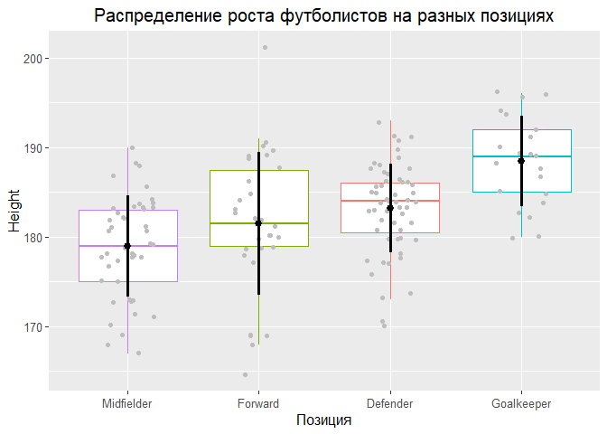
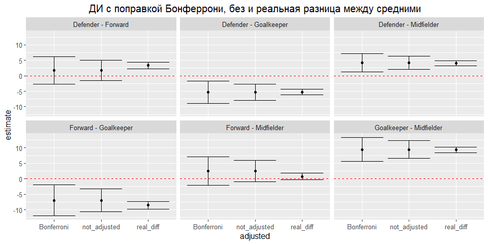

#Задание 1

<!-- -->

## Парный т-тест без поправки 


```
## 
## 	Pairwise comparisons using t tests with non-pooled SD 
## 
## data:  soccer_wrk$Height and soccer_wrk$Position 
## 
##            Defender Forward Goalkeeper
## Forward    0.29106  -       -         
## Goalkeeper 0.00026  0.00039 -         
## Midfielder 0.00020  0.14559 2.5e-08   
## 
## P value adjustment method: none
```

## Парный т-тест с поправкой Бонферрони


```
## 
## 	Pairwise comparisons using t tests with non-pooled SD 
## 
## data:  soccer_wrk$Height and soccer_wrk$Position 
## 
##            Defender Forward Goalkeeper
## Forward    1.0000   -       -         
## Goalkeeper 0.0015   0.0024  -         
## Midfielder 0.0012   0.8735  1.5e-07   
## 
## P value adjustment method: bonferroni
```

## ДИ без поправки


## ДИ с поправкой Бонферрони и 95% ДИ в генеральной совокупности


<!-- -->

*ОТВЕТ* ДИ покрывают реальную разницу средних

## p-values с поправкой Бонферрони


```
## # A tibble: 6 × 10
##   .y.    group1  group2    n1    n2 statistic    df       p   p.adj p.adj.signif
## * <chr>  <chr>   <chr>  <int> <int>     <dbl> <dbl>   <dbl>   <dbl> <chr>       
## 1 Height Defend… Forwa…    55    30      1.07  41.6 2.91e-1 1   e+0 ns          
## 2 Height Defend… Goalk…    55    21     -4.06  35.6 2.57e-4 2   e-3 **          
## 3 Height Defend… Midfi…    55    44      3.89  86.4 1.98e-4 1   e-3 **          
## 4 Height Forward Goalk…    30    21     -3.81  48.6 3.94e-4 2   e-3 **          
## 5 Height Forward Midfi…    30    44      1.48  48.4 1.46e-1 8.76e-1 ns          
## 6 Height Goalke… Midfi…    21    44      6.78  43.6 2.51e-8 1.51e-7 ****
```


# Задание 2 Попарные тесты

## Без поправки


```
## # A tibble: 6 × 10
##   .y.    group1  group2    n1    n2 statistic    df       p   p.adj p.adj.signif
## * <chr>  <chr>   <chr>  <int> <int>     <dbl> <dbl>   <dbl>   <dbl> <chr>       
## 1 Height Defend… Forwa…    55    30      1.07  41.6 2.91e-1 2.91e-1 ns          
## 2 Height Defend… Goalk…    55    21     -4.06  35.6 2.57e-4 2.57e-4 ***         
## 3 Height Defend… Midfi…    55    44      3.89  86.4 1.98e-4 1.98e-4 ***         
## 4 Height Forward Goalk…    30    21     -3.81  48.6 3.94e-4 3.94e-4 ***         
## 5 Height Forward Midfi…    30    44      1.48  48.4 1.46e-1 1.46e-1 ns          
## 6 Height Goalke… Midfi…    21    44      6.78  43.6 2.51e-8 2.51e-8 ****
```

*ОТВЕТ* Получилось 4 открытия, 1 ложноотрицательное (ошибка 2го рода)

## Поправка Холма


```
## # A tibble: 6 × 10
##   .y.    group1  group2    n1    n2 statistic    df       p   p.adj p.adj.signif
## * <chr>  <chr>   <chr>  <int> <int>     <dbl> <dbl>   <dbl>   <dbl> <chr>       
## 1 Height Defend… Forwa…    55    30      1.07  41.6 2.91e-1 2.92e-1 ns          
## 2 Height Defend… Goalk…    55    21     -4.06  35.6 2.57e-4 1   e-3 **          
## 3 Height Defend… Midfi…    55    44      3.89  86.4 1.98e-4 9.9 e-4 ***         
## 4 Height Forward Goalk…    30    21     -3.81  48.6 3.94e-4 1   e-3 **          
## 5 Height Forward Midfi…    30    44      1.48  48.4 1.46e-1 2.92e-1 ns          
## 6 Height Goalke… Midfi…    21    44      6.78  43.6 2.51e-8 1.51e-7 ****
```

```
## 
## 	Pairwise comparisons using t tests with non-pooled SD 
## 
## data:  soccer_wrk$Height and soccer_wrk$Position 
## 
##            Defender Forward Goalkeeper
## Forward    0.29118  -       -         
## Goalkeeper 0.00103  0.00118 -         
## Midfielder 0.00099  0.29118 1.5e-07   
## 
## P value adjustment method: holm
```

*ОТВЕТ* Получилось 4 открытия, 1 ложноотрицательное (ошибка 2го рода)

## Поправка Бенджамини-Хохберга


```
## # A tibble: 6 × 10
##   .y.    group1  group2    n1    n2 statistic    df       p   p.adj p.adj.signif
## * <chr>  <chr>   <chr>  <int> <int>     <dbl> <dbl>   <dbl>   <dbl> <chr>       
## 1 Height Defend… Forwa…    55    30      1.07  41.6 2.91e-1 2.91e-1 ns          
## 2 Height Defend… Goalk…    55    21     -4.06  35.6 2.57e-4 5.14e-4 ***         
## 3 Height Defend… Midfi…    55    44      3.89  86.4 1.98e-4 5.14e-4 ***         
## 4 Height Forward Goalk…    30    21     -3.81  48.6 3.94e-4 5.91e-4 ***         
## 5 Height Forward Midfi…    30    44      1.48  48.4 1.46e-1 1.75e-1 ns          
## 6 Height Goalke… Midfi…    21    44      6.78  43.6 2.51e-8 1.51e-7 ****
```

```
## 
## 	Pairwise comparisons using t tests with non-pooled SD 
## 
## data:  soccer_wrk$Height and soccer_wrk$Position 
## 
##            Defender Forward Goalkeeper
## Forward    0.29106  -       -         
## Goalkeeper 0.00051  0.00059 -         
## Midfielder 0.00051  0.17471 1.5e-07   
## 
## P value adjustment method: BH
```

*ОТВЕТ* Получилось 4 открытия, 1 ложноотрицательное (ошибка 2го рода)

