# 1. Общие сведения об исходной таблице данных


Table: Data summary

|                         |           |
|:------------------------|:----------|
|Name                     |Piped data |
|Number of rows           |916        |
|Number of columns        |74         |
|_______________________  |           |
|Column type frequency:   |           |
|factor                   |15         |
|numeric                  |59         |
|________________________ |           |
|Group variables          |None       |


**Variable type: factor**

|skim_variable | n_missing| complete_rate|ordered | n_unique|top_counts                     |
|:-------------|---------:|-------------:|:-------|--------:|:------------------------------|
|DMDEDUC2      |         0|             1|FALSE   |        5|4: 297, 5: 243, 3: 203, 2: 119 |
|RIAGENDR      |         0|             1|FALSE   |        2|1: 539, 2: 377                 |
|RIDRETH3      |         0|             1|FALSE   |        6|3: 463, 4: 175, 1: 101, 6: 78  |
|BPQ020        |         0|             1|FALSE   |        3|2: 506, 1: 409, 9: 1           |
|MCQ010        |         0|             1|FALSE   |        2|2: 772, 1: 144                 |
|MCQ035        |         0|             1|FALSE   |        2|2: 832, 1: 84                  |
|MCQ160B       |         0|             1|FALSE   |        2|2: 882, 1: 34                  |
|MCQ160C       |         0|             1|FALSE   |        2|2: 870, 1: 46                  |
|MCQ160E       |         0|             1|FALSE   |        2|2: 875, 1: 41                  |
|MCQ160F       |         0|             1|FALSE   |        2|2: 884, 1: 32                  |
|MCQ160M       |         0|             1|FALSE   |        3|2: 786, 1: 128, 9: 2           |
|MCQ160O       |         0|             1|FALSE   |        2|2: 877, 1: 39                  |
|MCQ220        |         0|             1|FALSE   |        2|2: 812, 1: 104                 |
|DIQ010        |         0|             1|FALSE   |        2|2: 772, 1: 144                 |
|SMQ040        |         0|             1|FALSE   |        3|3: 752, 1: 133, 2: 31          |


**Variable type: numeric**

|skim_variable | n_missing| complete_rate|     mean|      sd|       p0|      p25|      p50|      p75|     p100|hist  |
|:-------------|---------:|-------------:|--------:|-------:|--------:|--------:|--------:|--------:|--------:|:-----|
|SEQN          |         0|             1| 78749.87| 2968.55| 73557.00| 76158.75| 78867.50| 81432.00| 83724.00|▇▆▇▇▇ |
|DMDHHSIZ      |         0|             1|     2.89|    1.60|     1.00|     2.00|     2.00|     4.00|     7.00|▇▃▂▂▁ |
|DMDHHSZA      |         0|             1|     0.18|    0.51|     0.00|     0.00|     0.00|     0.00|     3.00|▇▁▁▁▁ |
|DMDHHSZB      |         0|             1|     0.38|    0.81|     0.00|     0.00|     0.00|     0.00|     4.00|▇▂▁▁▁ |
|DMDHHSZE      |         0|             1|     0.74|    0.82|     0.00|     0.00|     1.00|     1.00|     3.00|▇▅▁▃▁ |
|DMDMARTL      |         0|             1|     2.27|    1.68|     1.00|     1.00|     1.00|     3.00|     6.00|▇▂▁▂▁ |
|INDFMIN2      |         0|             1|     7.48|    3.32|     1.00|     5.00|     7.00|    11.00|    12.00|▃▅▆▃▇ |
|RIDAGEYR      |         0|             1|    54.70|   16.40|    20.00|    45.00|    56.00|    67.00|    80.00|▃▃▇▇▇ |
|DR1TALCO      |         0|             1|    11.49|   32.29|     0.00|     0.00|     0.00|     8.05|   591.40|▇▁▁▁▁ |
|DR1TCHOL      |         0|             1|   312.09|  272.02|     0.00|   134.00|   233.00|   426.00|  2584.00|▇▂▁▁▁ |
|DR1TFIBE      |         0|             1|    17.52|   11.38|     1.00|     9.70|    15.00|    22.50|   107.00|▇▂▁▁▁ |
|DR1TKCAL      |         0|             1|  2140.25| 1066.02|   358.00|  1424.75|  1936.50|  2626.25| 12108.00|▇▂▁▁▁ |
|DR1TMFAT      |         0|             1|    28.60|   17.37|     0.92|    16.65|    25.40|    36.87|   185.83|▇▂▁▁▁ |
|DR1TPFAT      |         0|             1|    19.77|   14.34|     0.22|     9.99|    16.38|    24.85|   135.35|▇▂▁▁▁ |
|DR1TSFAT      |         0|             1|    26.45|   16.82|     1.37|    14.75|    23.88|    34.59|   177.47|▇▂▁▁▁ |
|DR1TSUGR      |         0|             1|   107.66|   76.50|     2.75|    56.29|    90.46|   142.70|   835.70|▇▂▁▁▁ |
|DR1TTFAT      |         0|             1|    82.59|   48.62|     3.93|    49.53|    73.96|   105.91|   548.38|▇▂▁▁▁ |
|DRD340        |         0|             1|     1.48|    0.50|     1.00|     1.00|     1.00|     2.00|     2.00|▇▁▁▁▇ |
|DRD360        |         0|             1|     1.29|    0.52|     1.00|     1.00|     1.00|     2.00|     9.00|▇▁▁▁▁ |
|DRQSDIET      |         0|             1|     1.83|    0.38|     1.00|     2.00|     2.00|     2.00|     2.00|▂▁▁▁▇ |
|DRQSDT1       |         0|             1|     1.93|    0.25|     1.00|     2.00|     2.00|     2.00|     2.00|▁▁▁▁▇ |
|DRQSDT10      |         0|             1|     2.00|    0.07|     1.00|     2.00|     2.00|     2.00|     2.00|▁▁▁▁▇ |
|DRQSDT2       |         0|             1|     1.98|    0.15|     1.00|     2.00|     2.00|     2.00|     2.00|▁▁▁▁▇ |
|DRQSDT3       |         0|             1|     1.98|    0.15|     1.00|     2.00|     2.00|     2.00|     2.00|▁▁▁▁▇ |
|DRQSDT4       |         0|             1|     1.99|    0.08|     1.00|     2.00|     2.00|     2.00|     2.00|▁▁▁▁▇ |
|DRQSDT7       |         0|             1|     1.96|    0.19|     1.00|     2.00|     2.00|     2.00|     2.00|▁▁▁▁▇ |
|DRQSDT8       |         0|             1|     1.99|    0.07|     1.00|     2.00|     2.00|     2.00|     2.00|▁▁▁▁▇ |
|DRQSDT9       |         0|             1|     1.99|    0.10|     1.00|     2.00|     2.00|     2.00|     2.00|▁▁▁▁▇ |
|DRQSDT91      |         0|             1|     1.99|    0.12|     1.00|     2.00|     2.00|     2.00|     2.00|▁▁▁▁▇ |
|BMXBMI        |         0|             1|    29.38|    6.73|    17.00|    24.80|    28.10|    32.73|    77.50|▇▅▁▁▁ |
|BMXHT         |         0|             1|   168.80|   10.40|   142.60|   161.07|   169.10|   176.40|   199.40|▂▇▇▅▁ |
|BMXWT         |         0|             1|    83.97|   21.52|    40.20|    68.88|    80.00|    94.88|   180.10|▃▇▃▁▁ |
|LBXGH         |         0|             1|     5.80|    1.04|     4.20|     5.30|     5.60|     5.90|    13.90|▇▁▁▁▁ |
|BPQ050A       |         0|             1|     1.66|    0.47|     1.00|     1.00|     2.00|     2.00|     2.00|▅▁▁▁▇ |
|MCQ170M       |         0|             1|     1.90|    0.30|     1.00|     2.00|     2.00|     2.00|     2.00|▁▁▁▁▇ |
|PAD615        |         0|             1|    32.27|   88.64|     0.00|     0.00|     0.00|     0.00|   660.00|▇▁▁▁▁ |
|PAD630        |         0|             1|    48.25|   97.80|     0.00|     0.00|     0.00|    60.00|   660.00|▇▁▁▁▁ |
|PAD645        |         0|             1|    13.31|   39.39|     0.00|     0.00|     0.00|     0.00|   480.00|▇▁▁▁▁ |
|PAD660        |         0|             1|    15.78|   39.09|     0.00|     0.00|     0.00|     0.00|   360.00|▇▁▁▁▁ |
|PAD675        |         0|             1|    26.95|   47.13|     0.00|     0.00|     0.00|    45.00|   300.00|▇▁▁▁▁ |
|PAD680        |         0|             1|   450.12|  488.23|    10.00|   285.00|   480.00|   540.00|  9999.00|▇▁▁▁▁ |
|PAQ605        |         0|             1|     1.81|    0.39|     1.00|     2.00|     2.00|     2.00|     2.00|▂▁▁▁▇ |
|PAQ610        |         0|             1|     0.79|    1.81|     0.00|     0.00|     0.00|     0.00|     7.00|▇▁▁▁▁ |
|PAQ620        |         0|             1|     1.66|    0.48|     1.00|     1.00|     2.00|     2.00|     2.00|▅▁▁▁▇ |
|PAQ625        |         0|             1|     1.44|    2.25|     0.00|     0.00|     0.00|     3.00|     7.00|▇▁▁▂▁ |
|PAQ635        |         0|             1|     1.77|    0.42|     1.00|     2.00|     2.00|     2.00|     2.00|▂▁▁▁▇ |
|PAQ640        |         0|             1|     1.10|    2.21|     0.00|     0.00|     0.00|     0.00|     7.00|▇▁▁▁▁ |
|PAQ650        |         0|             1|     1.79|    0.41|     1.00|     2.00|     2.00|     2.00|     2.00|▂▁▁▁▇ |
|PAQ655        |         0|             1|     0.72|    1.59|     0.00|     0.00|     0.00|     0.00|     7.00|▇▁▁▁▁ |
|PAQ665        |         0|             1|     1.57|    0.49|     1.00|     1.00|     2.00|     2.00|     2.00|▆▁▁▁▇ |
|PAQ670        |         0|             1|     1.45|    2.07|     0.00|     0.00|     0.00|     3.00|     7.00|▇▁▂▁▁ |
|DIQ070        |         0|             1|     1.78|    0.41|     1.00|     2.00|     2.00|     2.00|     2.00|▂▁▁▁▇ |
|SMQ020        |         0|             1|     1.53|    0.50|     1.00|     1.00|     2.00|     2.00|     2.00|▇▁▁▁▇ |
|ALQ101        |         0|             1|     1.25|    0.43|     1.00|     1.00|     1.00|     1.00|     2.00|▇▁▁▁▂ |
|ALQ120Q       |         0|             1|     3.69|   17.68|     0.00|     0.00|     1.00|     3.00|   350.00|▇▁▁▁▁ |
|ALQ120U       |         0|             1|     1.57|    0.82|     1.00|     1.00|     1.00|     2.00|     3.00|▇▁▂▁▂ |
|ALQ130        |         0|             1|     2.84|   33.03|     0.00|     0.00|     1.00|     2.00|   999.00|▇▁▁▁▁ |
|BPXDI         |         0|             1|    70.15|   13.16|     0.00|    64.00|    71.33|    78.00|   110.00|▁▁▅▇▁ |
|BPXSY         |         0|             1|   126.50|   16.91|    64.67|   115.17|   124.67|   136.67|   202.67|▁▆▇▂▁ |

# Задание 1. Каким образом вы будете оценивать физическую активность респондентов? Есть ли у вас предварительные предположения относительно того, каким образом выбранный вами показатель может быть ассоциирован с гликированным гемоглобином?

**Ответ:** Физическую активность респодентов будем оценивать в виде суммарного количества минут активности за вычетом минут, проводимых сидя, с учетом интенсивности активностей. Расчет итоговой активности будем проводить по следующей формуле: сумма (кол-во дней Х кол-во минут в день Х поправочный коэффициент). Для Vigorous work/recreational активности поправочный коэффициент = 2 (берем за основу, что 1 минута такой активности эквивалентна двум минутам средней активности), для Moderate work/recreational и Walk or bicycle поправочный коэффициент = 1, а для sedentary activity поправочный коэффициент = - 0.1 (т.е. 1 минута, проведенная сидя, нивилирует положительный эффект 0.1 минуты средней активности). Таким образом итоговая активность total_PA = PAQ610 x PAD615 x 2 + PAQ625 x PAD630 x 1 + PAQ640 x PAD645 x 1 + PAQ655 x PAD660 x 2 + PAQ670 x PAD675 x 1 + 7(дней) x PAD680 x (-0.1).

Предположительно данный показатель отрицательно ассоциирован с гликированным гемоглобином, т.е. чем выше общая физическая активность, тем ниже уровень гликированного гемоглобина.


# Задание 2. Ковариаты для каких показателей вы включите в модель для коррекции эффекта физической активности в отношении гликированного гемоглобина? Каким образом вы будете их оценивать по имеющимся данным?

**Ответ**: исходя из построенного DAG показатели Age, Comorbidities, Education, Family income, Race, Sex, Smoking являются конфаундерам и должны быть скорректированы (включены в модель регрессии вместе с показателем физической активности).
Для Age будем использовать количественную переменную RIDAGEYR.
Для Comorbidities будем использовать категориальную переменную, которая принимает значение 1, если любая из переменных MCQ010, MCQ035, MCQ160c, MCQ160b, MCQ160e, MCQ160f, MCQ160m, MCQ160o, MCQ220, BPQ020, DIQ010 имеет значение 1 (Yes), и принимает 2, если все указанные переменные имеют значение 2 (No).
Для Education будем использовать категориальную переменную DMDEDUC2 (5 категорий) Для Family income будем использовать годовой доход семьи, поделенный на колич-во человек в семье (INDFMIN2/DMDHHSIZ), округленный до верхнего целочисленного значения, категориальная переменная.
Для Race будем использовать категориальную переменную RIDRETH3 (7 категорий).
Для Sex будем использовать категориальную переменную RIAGENDR (2 категории).
Для Smoking будем использовать интенсивность курения в настоящее время SMQ040, категориальная переменная (3 категории 1,2,3).

*Бонусное задание:* Age - конфаундер, Comorbidities - конфаундер, Education - конфаундер, Family income - конфаундер, Race - конфаундер, Sex - конфаундер, Smoking - прокси-конфаундер, Blood pressure - коллайдер, Diabetic medication - коллайдер, Marital status - предшественник exposure, Body Mass Index - медиатор

# Задание 3. Эксплораторный анализ данных, которые будем использовать в моделировании


```{=html}
<div id="bdugiecizl" style="padding-left:0px;padding-right:0px;padding-top:10px;padding-bottom:10px;overflow-x:auto;overflow-y:auto;width:auto;height:auto;">
<style>#bdugiecizl table {
  font-family: system-ui, 'Segoe UI', Roboto, Helvetica, Arial, sans-serif, 'Apple Color Emoji', 'Segoe UI Emoji', 'Segoe UI Symbol', 'Noto Color Emoji';
  -webkit-font-smoothing: antialiased;
  -moz-osx-font-smoothing: grayscale;
}

#bdugiecizl thead, #bdugiecizl tbody, #bdugiecizl tfoot, #bdugiecizl tr, #bdugiecizl td, #bdugiecizl th {
  border-style: none;
}

#bdugiecizl p {
  margin: 0;
  padding: 0;
}

#bdugiecizl .gt_table {
  display: table;
  border-collapse: collapse;
  line-height: normal;
  margin-left: auto;
  margin-right: auto;
  color: #333333;
  font-size: 16px;
  font-weight: normal;
  font-style: normal;
  background-color: #FFFFFF;
  width: auto;
  border-top-style: solid;
  border-top-width: 2px;
  border-top-color: #A8A8A8;
  border-right-style: none;
  border-right-width: 2px;
  border-right-color: #D3D3D3;
  border-bottom-style: solid;
  border-bottom-width: 2px;
  border-bottom-color: #A8A8A8;
  border-left-style: none;
  border-left-width: 2px;
  border-left-color: #D3D3D3;
}

#bdugiecizl .gt_caption {
  padding-top: 4px;
  padding-bottom: 4px;
}

#bdugiecizl .gt_title {
  color: #333333;
  font-size: 125%;
  font-weight: initial;
  padding-top: 4px;
  padding-bottom: 4px;
  padding-left: 5px;
  padding-right: 5px;
  border-bottom-color: #FFFFFF;
  border-bottom-width: 0;
}

#bdugiecizl .gt_subtitle {
  color: #333333;
  font-size: 85%;
  font-weight: initial;
  padding-top: 3px;
  padding-bottom: 5px;
  padding-left: 5px;
  padding-right: 5px;
  border-top-color: #FFFFFF;
  border-top-width: 0;
}

#bdugiecizl .gt_heading {
  background-color: #FFFFFF;
  text-align: center;
  border-bottom-color: #FFFFFF;
  border-left-style: none;
  border-left-width: 1px;
  border-left-color: #D3D3D3;
  border-right-style: none;
  border-right-width: 1px;
  border-right-color: #D3D3D3;
}

#bdugiecizl .gt_bottom_border {
  border-bottom-style: solid;
  border-bottom-width: 2px;
  border-bottom-color: #D3D3D3;
}

#bdugiecizl .gt_col_headings {
  border-top-style: solid;
  border-top-width: 2px;
  border-top-color: #D3D3D3;
  border-bottom-style: solid;
  border-bottom-width: 2px;
  border-bottom-color: #D3D3D3;
  border-left-style: none;
  border-left-width: 1px;
  border-left-color: #D3D3D3;
  border-right-style: none;
  border-right-width: 1px;
  border-right-color: #D3D3D3;
}

#bdugiecizl .gt_col_heading {
  color: #333333;
  background-color: #FFFFFF;
  font-size: 100%;
  font-weight: normal;
  text-transform: inherit;
  border-left-style: none;
  border-left-width: 1px;
  border-left-color: #D3D3D3;
  border-right-style: none;
  border-right-width: 1px;
  border-right-color: #D3D3D3;
  vertical-align: bottom;
  padding-top: 5px;
  padding-bottom: 6px;
  padding-left: 5px;
  padding-right: 5px;
  overflow-x: hidden;
}

#bdugiecizl .gt_column_spanner_outer {
  color: #333333;
  background-color: #FFFFFF;
  font-size: 100%;
  font-weight: normal;
  text-transform: inherit;
  padding-top: 0;
  padding-bottom: 0;
  padding-left: 4px;
  padding-right: 4px;
}

#bdugiecizl .gt_column_spanner_outer:first-child {
  padding-left: 0;
}

#bdugiecizl .gt_column_spanner_outer:last-child {
  padding-right: 0;
}

#bdugiecizl .gt_column_spanner {
  border-bottom-style: solid;
  border-bottom-width: 2px;
  border-bottom-color: #D3D3D3;
  vertical-align: bottom;
  padding-top: 5px;
  padding-bottom: 5px;
  overflow-x: hidden;
  display: inline-block;
  width: 100%;
}

#bdugiecizl .gt_spanner_row {
  border-bottom-style: hidden;
}

#bdugiecizl .gt_group_heading {
  padding-top: 8px;
  padding-bottom: 8px;
  padding-left: 5px;
  padding-right: 5px;
  color: #333333;
  background-color: #FFFFFF;
  font-size: 100%;
  font-weight: initial;
  text-transform: inherit;
  border-top-style: solid;
  border-top-width: 2px;
  border-top-color: #D3D3D3;
  border-bottom-style: solid;
  border-bottom-width: 2px;
  border-bottom-color: #D3D3D3;
  border-left-style: none;
  border-left-width: 1px;
  border-left-color: #D3D3D3;
  border-right-style: none;
  border-right-width: 1px;
  border-right-color: #D3D3D3;
  vertical-align: middle;
  text-align: left;
}

#bdugiecizl .gt_empty_group_heading {
  padding: 0.5px;
  color: #333333;
  background-color: #FFFFFF;
  font-size: 100%;
  font-weight: initial;
  border-top-style: solid;
  border-top-width: 2px;
  border-top-color: #D3D3D3;
  border-bottom-style: solid;
  border-bottom-width: 2px;
  border-bottom-color: #D3D3D3;
  vertical-align: middle;
}

#bdugiecizl .gt_from_md > :first-child {
  margin-top: 0;
}

#bdugiecizl .gt_from_md > :last-child {
  margin-bottom: 0;
}

#bdugiecizl .gt_row {
  padding-top: 8px;
  padding-bottom: 8px;
  padding-left: 5px;
  padding-right: 5px;
  margin: 10px;
  border-top-style: solid;
  border-top-width: 1px;
  border-top-color: #D3D3D3;
  border-left-style: none;
  border-left-width: 1px;
  border-left-color: #D3D3D3;
  border-right-style: none;
  border-right-width: 1px;
  border-right-color: #D3D3D3;
  vertical-align: middle;
  overflow-x: hidden;
}

#bdugiecizl .gt_stub {
  color: #333333;
  background-color: #FFFFFF;
  font-size: 100%;
  font-weight: initial;
  text-transform: inherit;
  border-right-style: solid;
  border-right-width: 2px;
  border-right-color: #D3D3D3;
  padding-left: 5px;
  padding-right: 5px;
}

#bdugiecizl .gt_stub_row_group {
  color: #333333;
  background-color: #FFFFFF;
  font-size: 100%;
  font-weight: initial;
  text-transform: inherit;
  border-right-style: solid;
  border-right-width: 2px;
  border-right-color: #D3D3D3;
  padding-left: 5px;
  padding-right: 5px;
  vertical-align: top;
}

#bdugiecizl .gt_row_group_first td {
  border-top-width: 2px;
}

#bdugiecizl .gt_row_group_first th {
  border-top-width: 2px;
}

#bdugiecizl .gt_summary_row {
  color: #333333;
  background-color: #FFFFFF;
  text-transform: inherit;
  padding-top: 8px;
  padding-bottom: 8px;
  padding-left: 5px;
  padding-right: 5px;
}

#bdugiecizl .gt_first_summary_row {
  border-top-style: solid;
  border-top-color: #D3D3D3;
}

#bdugiecizl .gt_first_summary_row.thick {
  border-top-width: 2px;
}

#bdugiecizl .gt_last_summary_row {
  padding-top: 8px;
  padding-bottom: 8px;
  padding-left: 5px;
  padding-right: 5px;
  border-bottom-style: solid;
  border-bottom-width: 2px;
  border-bottom-color: #D3D3D3;
}

#bdugiecizl .gt_grand_summary_row {
  color: #333333;
  background-color: #FFFFFF;
  text-transform: inherit;
  padding-top: 8px;
  padding-bottom: 8px;
  padding-left: 5px;
  padding-right: 5px;
}

#bdugiecizl .gt_first_grand_summary_row {
  padding-top: 8px;
  padding-bottom: 8px;
  padding-left: 5px;
  padding-right: 5px;
  border-top-style: double;
  border-top-width: 6px;
  border-top-color: #D3D3D3;
}

#bdugiecizl .gt_last_grand_summary_row_top {
  padding-top: 8px;
  padding-bottom: 8px;
  padding-left: 5px;
  padding-right: 5px;
  border-bottom-style: double;
  border-bottom-width: 6px;
  border-bottom-color: #D3D3D3;
}

#bdugiecizl .gt_striped {
  background-color: rgba(128, 128, 128, 0.05);
}

#bdugiecizl .gt_table_body {
  border-top-style: solid;
  border-top-width: 2px;
  border-top-color: #D3D3D3;
  border-bottom-style: solid;
  border-bottom-width: 2px;
  border-bottom-color: #D3D3D3;
}

#bdugiecizl .gt_footnotes {
  color: #333333;
  background-color: #FFFFFF;
  border-bottom-style: none;
  border-bottom-width: 2px;
  border-bottom-color: #D3D3D3;
  border-left-style: none;
  border-left-width: 2px;
  border-left-color: #D3D3D3;
  border-right-style: none;
  border-right-width: 2px;
  border-right-color: #D3D3D3;
}

#bdugiecizl .gt_footnote {
  margin: 0px;
  font-size: 90%;
  padding-top: 4px;
  padding-bottom: 4px;
  padding-left: 5px;
  padding-right: 5px;
}

#bdugiecizl .gt_sourcenotes {
  color: #333333;
  background-color: #FFFFFF;
  border-bottom-style: none;
  border-bottom-width: 2px;
  border-bottom-color: #D3D3D3;
  border-left-style: none;
  border-left-width: 2px;
  border-left-color: #D3D3D3;
  border-right-style: none;
  border-right-width: 2px;
  border-right-color: #D3D3D3;
}

#bdugiecizl .gt_sourcenote {
  font-size: 90%;
  padding-top: 4px;
  padding-bottom: 4px;
  padding-left: 5px;
  padding-right: 5px;
}

#bdugiecizl .gt_left {
  text-align: left;
}

#bdugiecizl .gt_center {
  text-align: center;
}

#bdugiecizl .gt_right {
  text-align: right;
  font-variant-numeric: tabular-nums;
}

#bdugiecizl .gt_font_normal {
  font-weight: normal;
}

#bdugiecizl .gt_font_bold {
  font-weight: bold;
}

#bdugiecizl .gt_font_italic {
  font-style: italic;
}

#bdugiecizl .gt_super {
  font-size: 65%;
}

#bdugiecizl .gt_footnote_marks {
  font-size: 75%;
  vertical-align: 0.4em;
  position: initial;
}

#bdugiecizl .gt_asterisk {
  font-size: 100%;
  vertical-align: 0;
}

#bdugiecizl .gt_indent_1 {
  text-indent: 5px;
}

#bdugiecizl .gt_indent_2 {
  text-indent: 10px;
}

#bdugiecizl .gt_indent_3 {
  text-indent: 15px;
}

#bdugiecizl .gt_indent_4 {
  text-indent: 20px;
}

#bdugiecizl .gt_indent_5 {
  text-indent: 25px;
}

#bdugiecizl .katex-display {
  display: inline-flex !important;
  margin-bottom: 0.75em !important;
}

#bdugiecizl div.Reactable > div.rt-table > div.rt-thead > div.rt-tr.rt-tr-group-header > div.rt-th-group:after {
  height: 0px !important;
}
</style>
<table class="gt_table" data-quarto-disable-processing="false" data-quarto-bootstrap="false">
  <thead>
    <tr class="gt_col_headings">
      <th class="gt_col_heading gt_columns_bottom_border gt_left" rowspan="1" colspan="1" scope="col" id="&lt;span class='gt_from_md'&gt;&lt;strong&gt;Characteristic&lt;/strong&gt;&lt;/span&gt;"><span class='gt_from_md'><strong>Characteristic</strong></span></th>
      <th class="gt_col_heading gt_columns_bottom_border gt_center" rowspan="1" colspan="1" scope="col" id="&lt;span class='gt_from_md'&gt;&lt;strong&gt;N = 916&lt;/strong&gt;&lt;/span&gt;"><span class='gt_from_md'><strong>N = 916</strong></span></th>
    </tr>
  </thead>
  <tbody class="gt_table_body">
    <tr><td headers="label" class="gt_row gt_left" style="font-weight: bold;">gHg</td>
<td headers="stat_0" class="gt_row gt_center"><br /></td></tr>
    <tr><td headers="label" class="gt_row gt_left">    N Non-missing</td>
<td headers="stat_0" class="gt_row gt_center">916</td></tr>
    <tr><td headers="label" class="gt_row gt_left">    Mean (SD)</td>
<td headers="stat_0" class="gt_row gt_center">5.80 (1.04)</td></tr>
    <tr><td headers="label" class="gt_row gt_left">    Median (Q1-Q3)</td>
<td headers="stat_0" class="gt_row gt_center">5.60 (5.30-5.90)</td></tr>
    <tr><td headers="label" class="gt_row gt_left">    Min-Max</td>
<td headers="stat_0" class="gt_row gt_center">4.20-13.90</td></tr>
    <tr><td headers="label" class="gt_row gt_left" style="font-weight: bold;">total_PA</td>
<td headers="stat_0" class="gt_row gt_center"><br /></td></tr>
    <tr><td headers="label" class="gt_row gt_left">    N Non-missing</td>
<td headers="stat_0" class="gt_row gt_center">916</td></tr>
    <tr><td headers="label" class="gt_row gt_left">    Mean (SD)</td>
<td headers="stat_0" class="gt_row gt_center">441 (1,333)</td></tr>
    <tr><td headers="label" class="gt_row gt_left">    Median (Q1-Q3)</td>
<td headers="stat_0" class="gt_row gt_center">-48 (-291-572)</td></tr>
    <tr><td headers="label" class="gt_row gt_left">    Min-Max</td>
<td headers="stat_0" class="gt_row gt_center">-6,999-8,378</td></tr>
    <tr><td headers="label" class="gt_row gt_left" style="font-weight: bold;">Age</td>
<td headers="stat_0" class="gt_row gt_center"><br /></td></tr>
    <tr><td headers="label" class="gt_row gt_left">    N Non-missing</td>
<td headers="stat_0" class="gt_row gt_center">916</td></tr>
    <tr><td headers="label" class="gt_row gt_left">    Mean (SD)</td>
<td headers="stat_0" class="gt_row gt_center">55 (16)</td></tr>
    <tr><td headers="label" class="gt_row gt_left">    Median (Q1-Q3)</td>
<td headers="stat_0" class="gt_row gt_center">56 (45-67)</td></tr>
    <tr><td headers="label" class="gt_row gt_left">    Min-Max</td>
<td headers="stat_0" class="gt_row gt_center">20-80</td></tr>
    <tr><td headers="label" class="gt_row gt_left" style="font-weight: bold;">Comorbidities</td>
<td headers="stat_0" class="gt_row gt_center">580 (63%)</td></tr>
    <tr><td headers="label" class="gt_row gt_left" style="font-weight: bold;">Education</td>
<td headers="stat_0" class="gt_row gt_center"><br /></td></tr>
    <tr><td headers="label" class="gt_row gt_left">    1</td>
<td headers="stat_0" class="gt_row gt_center">54 (5.9%)</td></tr>
    <tr><td headers="label" class="gt_row gt_left">    2</td>
<td headers="stat_0" class="gt_row gt_center">119 (13%)</td></tr>
    <tr><td headers="label" class="gt_row gt_left">    3</td>
<td headers="stat_0" class="gt_row gt_center">203 (22%)</td></tr>
    <tr><td headers="label" class="gt_row gt_left">    4</td>
<td headers="stat_0" class="gt_row gt_center">297 (32%)</td></tr>
    <tr><td headers="label" class="gt_row gt_left">    5</td>
<td headers="stat_0" class="gt_row gt_center">243 (27%)</td></tr>
    <tr><td headers="label" class="gt_row gt_left" style="font-weight: bold;">Family_income</td>
<td headers="stat_0" class="gt_row gt_center"><br /></td></tr>
    <tr><td headers="label" class="gt_row gt_left">    1</td>
<td headers="stat_0" class="gt_row gt_center">104 (11%)</td></tr>
    <tr><td headers="label" class="gt_row gt_left">    2</td>
<td headers="stat_0" class="gt_row gt_center">232 (25%)</td></tr>
    <tr><td headers="label" class="gt_row gt_left">    3</td>
<td headers="stat_0" class="gt_row gt_center">211 (23%)</td></tr>
    <tr><td headers="label" class="gt_row gt_left">    4</td>
<td headers="stat_0" class="gt_row gt_center">142 (16%)</td></tr>
    <tr><td headers="label" class="gt_row gt_left">    5</td>
<td headers="stat_0" class="gt_row gt_center">43 (4.7%)</td></tr>
    <tr><td headers="label" class="gt_row gt_left">    6</td>
<td headers="stat_0" class="gt_row gt_center">118 (13%)</td></tr>
    <tr><td headers="label" class="gt_row gt_left">    7</td>
<td headers="stat_0" class="gt_row gt_center">24 (2.6%)</td></tr>
    <tr><td headers="label" class="gt_row gt_left">    8</td>
<td headers="stat_0" class="gt_row gt_center">14 (1.5%)</td></tr>
    <tr><td headers="label" class="gt_row gt_left">    9</td>
<td headers="stat_0" class="gt_row gt_center">11 (1.2%)</td></tr>
    <tr><td headers="label" class="gt_row gt_left">    10</td>
<td headers="stat_0" class="gt_row gt_center">5 (0.5%)</td></tr>
    <tr><td headers="label" class="gt_row gt_left">    11</td>
<td headers="stat_0" class="gt_row gt_center">5 (0.5%)</td></tr>
    <tr><td headers="label" class="gt_row gt_left">    12</td>
<td headers="stat_0" class="gt_row gt_center">7 (0.8%)</td></tr>
    <tr><td headers="label" class="gt_row gt_left" style="font-weight: bold;">Race</td>
<td headers="stat_0" class="gt_row gt_center"><br /></td></tr>
    <tr><td headers="label" class="gt_row gt_left">    1</td>
<td headers="stat_0" class="gt_row gt_center">101 (11%)</td></tr>
    <tr><td headers="label" class="gt_row gt_left">    2</td>
<td headers="stat_0" class="gt_row gt_center">75 (8.2%)</td></tr>
    <tr><td headers="label" class="gt_row gt_left">    3</td>
<td headers="stat_0" class="gt_row gt_center">463 (51%)</td></tr>
    <tr><td headers="label" class="gt_row gt_left">    4</td>
<td headers="stat_0" class="gt_row gt_center">175 (19%)</td></tr>
    <tr><td headers="label" class="gt_row gt_left">    6</td>
<td headers="stat_0" class="gt_row gt_center">78 (8.5%)</td></tr>
    <tr><td headers="label" class="gt_row gt_left">    7</td>
<td headers="stat_0" class="gt_row gt_center">24 (2.6%)</td></tr>
    <tr><td headers="label" class="gt_row gt_left" style="font-weight: bold;">Sex</td>
<td headers="stat_0" class="gt_row gt_center"><br /></td></tr>
    <tr><td headers="label" class="gt_row gt_left">    Female</td>
<td headers="stat_0" class="gt_row gt_center">377 (41%)</td></tr>
    <tr><td headers="label" class="gt_row gt_left">    Male</td>
<td headers="stat_0" class="gt_row gt_center">539 (59%)</td></tr>
    <tr><td headers="label" class="gt_row gt_left" style="font-weight: bold;">Smoking</td>
<td headers="stat_0" class="gt_row gt_center"><br /></td></tr>
    <tr><td headers="label" class="gt_row gt_left">    1</td>
<td headers="stat_0" class="gt_row gt_center">133 (15%)</td></tr>
    <tr><td headers="label" class="gt_row gt_left">    2</td>
<td headers="stat_0" class="gt_row gt_center">31 (3.4%)</td></tr>
    <tr><td headers="label" class="gt_row gt_left">    3</td>
<td headers="stat_0" class="gt_row gt_center">752 (82%)</td></tr>
  </tbody>
  
  
</table>
</div>
```


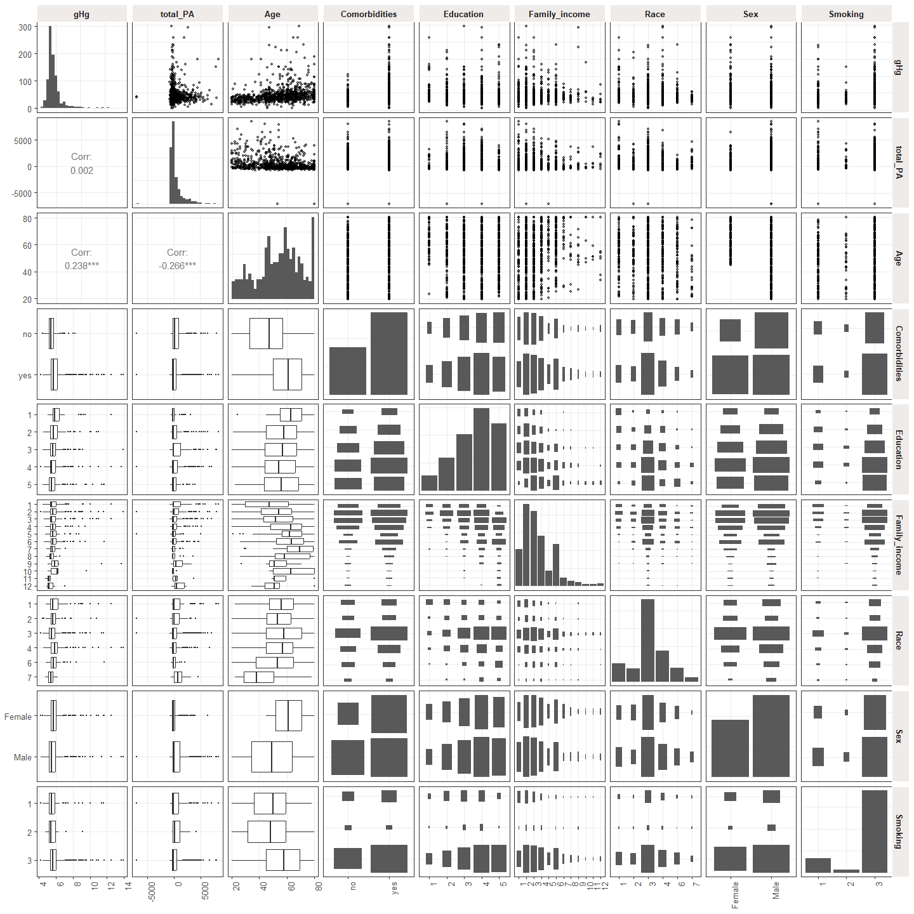<!-- -->

# Задание 4. Оценка модели для зависимости гликированного гемоглобина от выбранного вами показателя физической активности без ковариат и с ними. Диагностика.

## Модель без ковариат
Формула и коэффициенты модели

```
## 
## Call:
## lm(formula = gHg ~ total_PA, data = cleaned_data)
## 
## Coefficients:
## (Intercept)     total_PA  
##   5.802e+00    1.411e-06
```

### Диагностика. Fitted versus residuals & Scale-location
<!-- -->


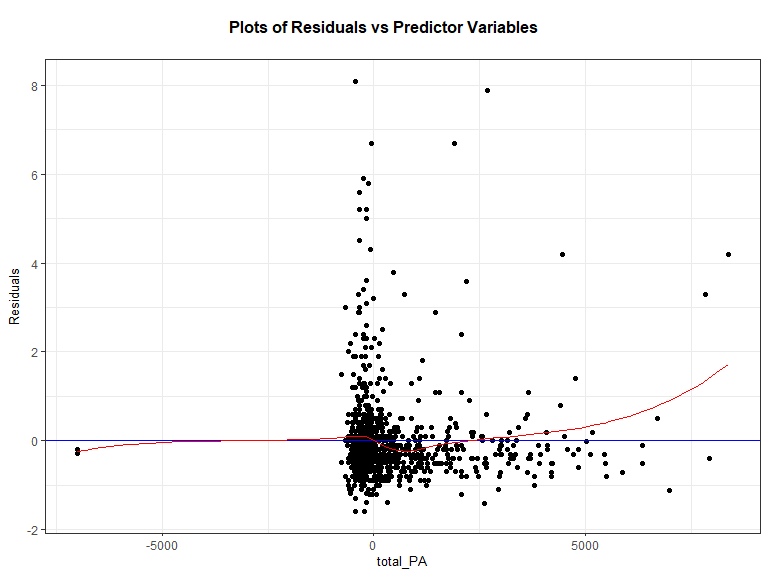<!-- -->

1. Возможно источником нелинейности являются выбросы предиктора total_PA, для коррекции данной модели уберем респодентов с экстремально низкими значениями показателя физической активности  -1000 и ниже и трансформируем предиктор с помощью логарифмической функции.

2. Присутствует гетероскедастичность. Коррекция: используем sandwich эстиматоры ошибок. 

### Диагностика. QQ-plot и гистограмма

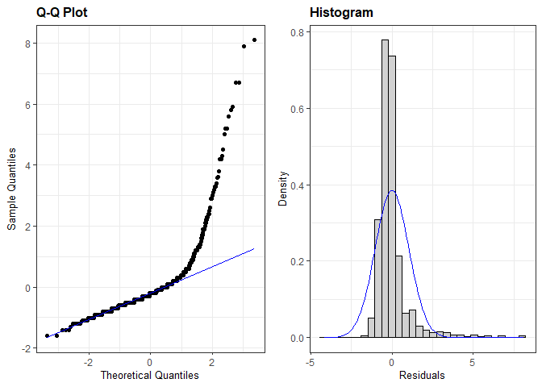<!-- -->

Присутствует ассиметричность распределения. Коррекцию проводить не будем. Возможно ассиметричность будет снижена после удаления экстремальных значений и трансформации предиктора log(total_PA).

### Диагностика. Residuals vs Leverage

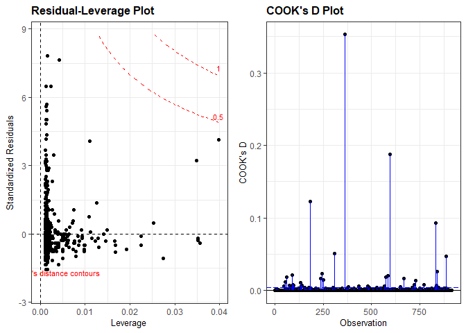<!-- -->

Все расстояния Кука меньше 0.5, Однако, есть множество значений расстояния Кука превышающих 0.004 (4/916). Так как таких точек много, скорее всего это не является ошибкой анкетирования, поэтому этих респодентов оставляем.


## Модель с ковариатами
Формула и коэффициенты модели

```
## 
## Call:
## lm(formula = gHg ~ total_PA + Age + Comorbidities + Education + 
##     Family_income + Race + Sex + Smoking, data = cleaned_data)
## 
## Coefficients:
##      (Intercept)          total_PA               Age  Comorbiditiesyes  
##        5.292e+00         5.178e-05         1.296e-02         3.827e-01  
##       Education2        Education3        Education4        Education5  
##       -1.372e-01        -3.156e-01        -3.040e-01        -3.664e-01  
##   Family_income2    Family_income3    Family_income4    Family_income5  
##       -2.205e-02        -2.821e-02        -1.528e-01        -5.980e-02  
##   Family_income6    Family_income7    Family_income8    Family_income9  
##        7.967e-03        -3.044e-01        -4.893e-01         1.089e+00  
##  Family_income10   Family_income11   Family_income12             Race2  
##        7.684e-01        -6.185e-01        -1.671e-01        -1.470e-01  
##            Race3             Race4             Race6             Race7  
##       -3.148e-01         6.958e-02         9.882e-02        -3.195e-01  
##          SexMale          Smoking2          Smoking3  
##        3.012e-02        -9.643e-02         4.771e-03
```
### Диагностика. Fitted versus residuals & Scale-location
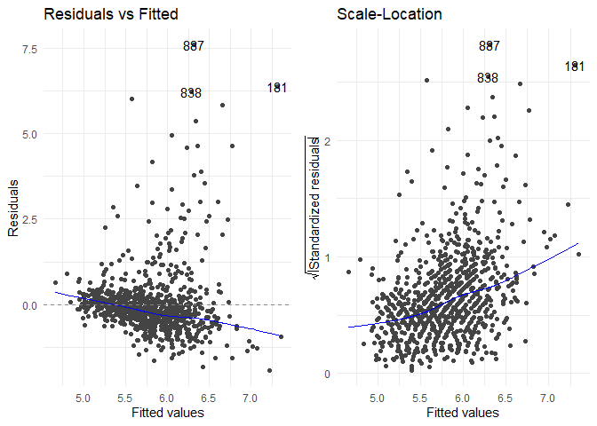<!-- -->

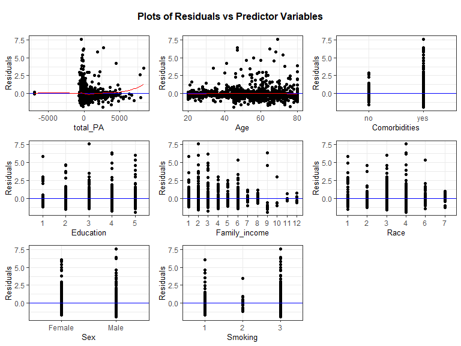<!-- -->

1. Возможно источником нелинейности являются выбросы предиктора total_PA, для коррекции данной модели уберем респодентов с экстремально низкими значениями  - 1000 и ниже.

2. Присутствует гетероскедастичность. Коррекция: используем sandwich естиматоры ошибок. coeftest(pima_ins, vcov. = vcovHC, type = "HC1")

### Диагностика. QQ-plot и гистограмма

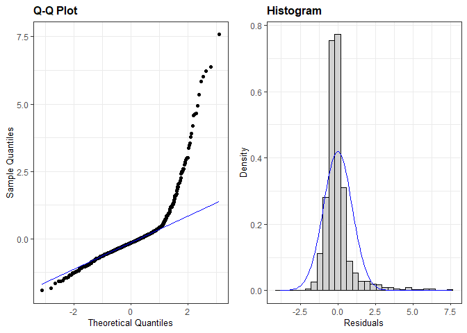<!-- -->

Присутствует ассиметричность распределения. Коррекцию проводить не будем. Возможно ассиметричность будет снижена после удаления экстремальных значений и предиктора total_PA.

### Диагностика. Residuals vs Leverage

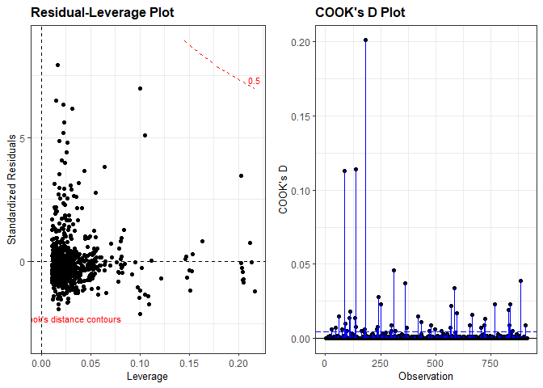<!-- -->

Все расстояния Кука меньше 0.5, Однако, есть множество значений расстояния Кука первышающих 0.004 (4/916). Так как таких точек много, скорее всего это не является технической ошибкой анкетирования, поэтому этих респодентов оставляем.

### Диагностика. Мультиколлинеарность:

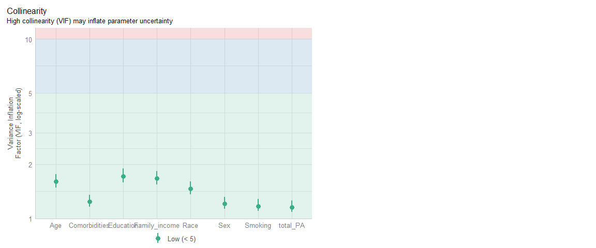<!-- -->

Коэффициенты корреляции Пирсона:


```
##            total_PA        Age
## total_PA  1.0000000 -0.2656345
## Age      -0.2656345  1.0000000
```
Мультиколлинеарность не присутствует.


Оценки всех коэффициентов и констант со стандартными ошибками, значения t-критерия и p-value для проверки нулевой гипотезы о равенстве 0 коэффициентов

```
## 
## Call:
## lm(formula = gHg ~ total_PA + Age + Comorbidities + Education + 
##     Family_income + Race + Sex + Smoking, data = cleaned_data)
## 
## Residuals:
##     Min      1Q  Median      3Q     Max 
## -1.9197 -0.4621 -0.1519  0.1711  7.5861 
## 
## Coefficients:
##                    Estimate Std. Error t value Pr(>|t|)    
## (Intercept)       5.292e+00  2.269e-01  23.318  < 2e-16 ***
## total_PA          5.178e-05  2.564e-05   2.019 0.043769 *  
## Age               1.296e-02  2.466e-03   5.257 1.84e-07 ***
## Comorbiditiesyes  3.827e-01  7.362e-02   5.198 2.50e-07 ***
## Education2       -1.372e-01  1.643e-01  -0.835 0.403961    
## Education3       -3.156e-01  1.595e-01  -1.978 0.048262 *  
## Education4       -3.040e-01  1.579e-01  -1.925 0.054568 .  
## Education5       -3.664e-01  1.673e-01  -2.190 0.028801 *  
## Family_income2   -2.205e-02  1.166e-01  -0.189 0.849984    
## Family_income3   -2.821e-02  1.220e-01  -0.231 0.817170    
## Family_income4   -1.528e-01  1.341e-01  -1.140 0.254770    
## Family_income5   -5.980e-02  1.838e-01  -0.325 0.745062    
## Family_income6    7.967e-03  1.459e-01   0.055 0.956460    
## Family_income7   -3.044e-01  2.288e-01  -1.331 0.183689    
## Family_income8   -4.893e-01  2.806e-01  -1.744 0.081481 .  
## Family_income9    1.089e+00  3.142e-01   3.465 0.000556 ***
## Family_income10   7.684e-01  4.497e-01   1.708 0.087904 .  
## Family_income11  -6.185e-01  4.491e-01  -1.377 0.168775    
## Family_income12  -1.671e-01  3.853e-01  -0.434 0.664720    
## Race2            -1.470e-01  1.529e-01  -0.962 0.336470    
## Race3            -3.148e-01  1.173e-01  -2.683 0.007430 ** 
## Race4             6.958e-02  1.289e-01   0.540 0.589374    
## Race6             9.882e-02  1.574e-01   0.628 0.530308    
## Race7            -3.195e-01  2.277e-01  -1.403 0.161032    
## SexMale           3.012e-02  7.110e-02   0.424 0.671948    
## Smoking2         -9.643e-02  1.951e-01  -0.494 0.621297    
## Smoking3          4.771e-03  9.643e-02   0.049 0.960550    
## ---
## Signif. codes:  0 '***' 0.001 '**' 0.01 '*' 0.05 '.' 0.1 ' ' 1
## 
## Residual standard error: 0.9643 on 889 degrees of freedom
## Multiple R-squared:  0.1567,	Adjusted R-squared:  0.132 
## F-statistic: 6.352 on 26 and 889 DF,  p-value: < 2.2e-16
```

Табличное представления оценок и доверительные интервалы

```
## # A tibble: 27 × 7
##    term               estimate std.error statistic  p.value   conf.low conf.high
##    <chr>                 <dbl>     <dbl>     <dbl>    <dbl>      <dbl>     <dbl>
##  1 (Intercept)       5.29      0.227        23.3   3.24e-94    4.85e+0  5.74    
##  2 total_PA          0.0000518 0.0000256     2.02  4.38e- 2    1.45e-6  0.000102
##  3 Age               0.0130    0.00247       5.26  1.84e- 7    8.12e-3  0.0178  
##  4 Comorbiditiesyes  0.383     0.0736        5.20  2.50e- 7    2.38e-1  0.527   
##  5 Education2       -0.137     0.164        -0.835 4.04e- 1   -4.60e-1  0.185   
##  6 Education3       -0.316     0.160        -1.98  4.83e- 2   -6.29e-1 -0.00242 
##  7 Education4       -0.304     0.158        -1.92  5.46e- 2   -6.14e-1  0.00597 
##  8 Education5       -0.366     0.167        -2.19  2.88e- 2   -6.95e-1 -0.0380  
##  9 Family_income2   -0.0221    0.117        -0.189 8.50e- 1   -2.51e-1  0.207   
## 10 Family_income3   -0.0282    0.122        -0.231 8.17e- 1   -2.68e-1  0.211   
## # ℹ 17 more rows
```


## Коррекция.
Удалим экстремальные значения (-1000 и меньше) у предиктора total_PA и трансформируем данный предиктор с помощью натурального логарифма

### Модель без ковариат.

```
## 
## Call:
## lm(formula = gHg ~ log(total_PA + 1000, 0.1), data = cleaned_data %>% 
##     filter(total_PA > -1000))
## 
## Coefficients:
##               (Intercept)  log(total_PA + 1000, 0.1)  
##                    6.2735                     0.1539
```
#### Диагностика после коррекции. Fitted versus residuals & Scale-location

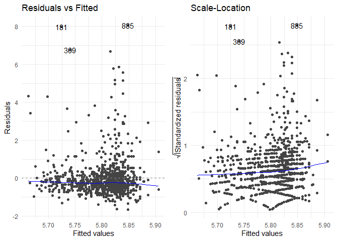<!-- -->


<!-- -->

#### Диагностика после коррекции. QQ-plot и гистограмма

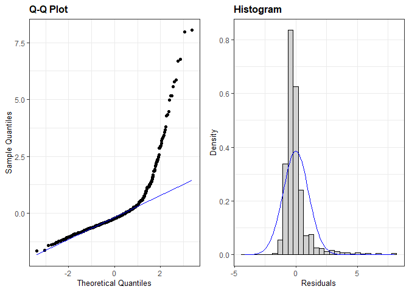<!-- -->

#### Диагностика после коррекции. Residuals vs Leverage

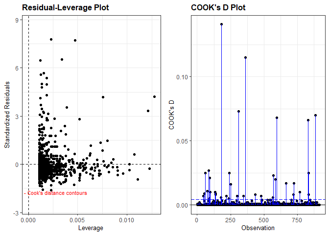<!-- -->

*Вывод*: После удаления выбросов и использования натурального логарифма разброс остатков стал более равномерным, а расстояния Кука уменьшились. 

Оценки всех коэффициентов и констант со стандартными ошибками, значения t-критерия и p-value для проверки нулевой гипотезы о равенстве 0 коэффициентов

```
## # A tibble: 2 × 7
##   term                  estimate std.error statistic  p.value conf.low conf.high
##   <chr>                    <dbl>     <dbl>     <dbl>    <dbl>    <dbl>     <dbl>
## 1 (Intercept)              6.27      0.440     14.3  8.82e-42    5.41      7.14 
## 2 log(total_PA + 1000,…    0.154     0.144      1.07 2.85e- 1   -0.128     0.436
```


### Модель с ковариатами.


```
## 
## Call:
## lm(formula = gHg ~ log(total_PA + 1000, 0.1) + Age + Comorbidities + 
##     Education + Family_income + Race + Sex + Smoking, data = cleaned_data %>% 
##     filter(total_PA > -1000))
## 
## Coefficients:
##               (Intercept)  log(total_PA + 1000, 0.1)  
##                  4.969112                  -0.121369  
##                       Age           Comorbiditiesyes  
##                  0.012550                   0.387390  
##                Education2                 Education3  
##                 -0.125801                  -0.298515  
##                Education4                 Education5  
##                 -0.292814                  -0.363891  
##            Family_income2             Family_income3  
##                 -0.028089                  -0.033693  
##            Family_income4             Family_income5  
##                 -0.158696                  -0.064046  
##            Family_income6             Family_income7  
##                  0.005471                  -0.309946  
##            Family_income8             Family_income9  
##                 -0.494274                   1.093315  
##           Family_income10            Family_income11  
##                  0.757732                  -0.610148  
##           Family_income12                      Race2  
##                 -0.157224                  -0.161144  
##                     Race3                      Race4  
##                 -0.325640                   0.051949  
##                     Race6                      Race7  
##                  0.076509                  -0.328953  
##                   SexMale                   Smoking2  
##                  0.038699                  -0.104664  
##                  Smoking3  
##                  0.001173
```

#### Диагностика после корреции. Fitted versus residuals & Scale-location
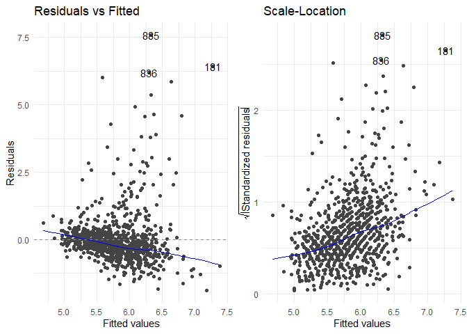<!-- -->


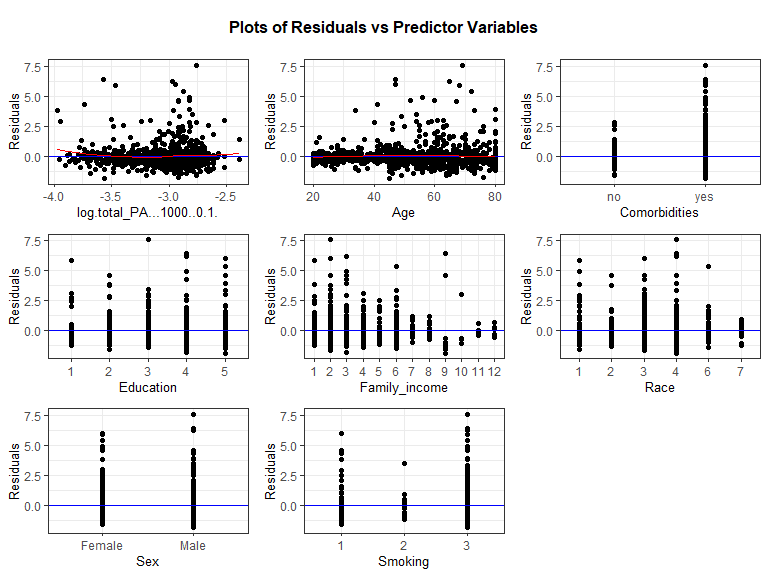<!-- -->

#### Диагностика после коррекции. QQ-plot и гистограмма

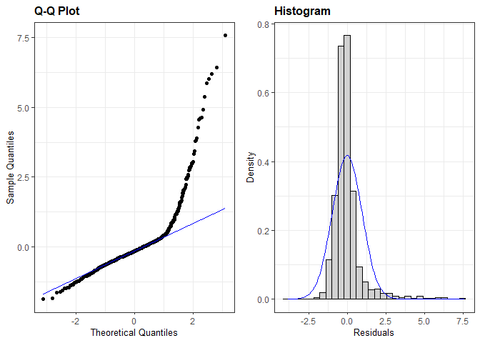<!-- -->

#### Диагностика после коррекции. Residuals vs Leverage

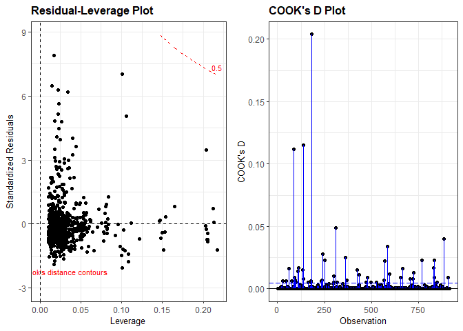<!-- -->

#### Диагностика после коррекции. Мультиколлинеарность:

<!-- -->

Коэффициенты корреляции Пирсона:


```
##            total_PA        Age
## total_PA  1.0000000 -0.2664293
## Age      -0.2664293  1.0000000
```
*Вывод*: После удаления выбросов и использования натурального логарифма разброс остатков не изменился и расстояния Кука значительно не изменились.

Оценки всех коэффициентов и констант со стандартными ошибками, значения t-критерия и p-value для проверки нулевой гипотезы о равенстве 0 коэффициентов

```
## # A tibble: 27 × 7
##    term                 estimate std.error statistic  p.value conf.low conf.high
##    <chr>                   <dbl>     <dbl>     <dbl>    <dbl>    <dbl>     <dbl>
##  1 (Intercept)            4.97     0.448      11.1   7.48e-27  4.09       5.85  
##  2 log(total_PA + 1000…  -0.121    0.144      -0.843 4.00e- 1 -0.404      0.161 
##  3 Age                    0.0125   0.00211     5.96  3.60e- 9  0.00842    0.0167
##  4 Comorbiditiesyes       0.387    0.0609      6.36  3.31e-10  0.268      0.507 
##  5 Education2            -0.126    0.194      -0.648 5.17e- 1 -0.507      0.255 
##  6 Education3            -0.299    0.189      -1.58  1.14e- 1 -0.669      0.0719
##  7 Education4            -0.293    0.184      -1.59  1.12e- 1 -0.654      0.0683
##  8 Education5            -0.364    0.191      -1.90  5.73e- 2 -0.739      0.0114
##  9 Family_income2        -0.0281   0.124      -0.227 8.21e- 1 -0.271      0.215 
## 10 Family_income3        -0.0337   0.120      -0.280 7.79e- 1 -0.270      0.202 
## # ℹ 17 more rows
```

# Задание 5. Представьте результаты оценки модели без ковариат и с ковариатами в виде точечной и интервальной оценки эффекта физической активности. Дайте им словесную интерпретацию. Какие выводы мы можем сделать, исходя из точечной оценки? А из интервальной? Как вы думаете, можно ли считать эффект клинически значимым? Если затрудняетесь с ответом, что бы вам помогло дать ответ на этот вопрос?

1) Результаты оценки модели без ковариат в виде точечной оценки эффекта физической активности:
0.154 (p > 0.05).


2) Результаты оценки модели без ковариат в виде интеральной оценки эффекта физической активности:
0.154 (95% ДИ: -0.128 - 0.436, p > 0.05).


3) Результаты оценки модели с ковариатами в виде точечной оценки эффекта физической активности:
-0.121 (p > 0.05).


4) Результаты оценки модели с ковариатами в виде интеральной оценки эффекта физической активности:
-0.121 (95% ДИ: -0.404 - 0.161, p > 0.05).

*Интерпретация* В обеих моделях (без и с ковариатами) мы не можем отвергнуть нулевую гипотезу о нулевом эффекте физической активности на уровень гликированного гемоглобина. При интервальной оценке в обеих моделях интервал включает значение 0. Эффект является также клинически незначимым.

# Задание 6. Проверьте гипотезу об отсутствии ассоциации между физической активностью и гликированным гемоглобином. Сделайте выводы по полученным результатам.

Н0: корреляция между физической активностью и гликированным гемоглобином равна 0.
Н1: корреляция между физической активностью и гликированным гемоглобином не равна 0.

Тест коэффициента корреляции


```
## 
## 	Pearson's product-moment correlation
## 
## data:  temp$gHg and log(temp$total_PA + 1000, 0.1)
## t = 1.258, df = 912, p-value = 0.2087
## alternative hypothesis: true correlation is not equal to 0
## 95 percent confidence interval:
##  -0.02328681  0.10618023
## sample estimates:
##        cor 
## 0.04162142
```
*Выводы*: мы не можем отвергнуть гипотезу об отсутствии линейной корреляции между логарифмом уровня физической активности и гликированным гемоглобином.

# Задание 7. Является ли пол модификатором эффекта физической активности в отношении гликированного гемоглобина? Если да, каков эффект для мужчин и женщин и насколько он отличается между ними?


```
## 
## Call:
## lm(formula = gHg ~ log(total_PA + 1000, 0.1) * Sex, data = cleaned_data %>% 
##     filter(total_PA > -1000))
## 
## Residuals:
##     Min      1Q  Median      3Q     Max 
## -1.6719 -0.5092 -0.2175  0.1274  8.0949 
## 
## Coefficients:
##                                   Estimate Std. Error t value Pr(>|t|)    
## (Intercept)                        5.73307    0.70694   8.110 1.63e-15 ***
## log(total_PA + 1000, 0.1)         -0.05025    0.23623  -0.213    0.832    
## SexMale                            0.53823    0.84385   0.638    0.524    
## log(total_PA + 1000, 0.1):SexMale  0.21895    0.27855   0.786    0.432    
## ---
## Signif. codes:  0 '***' 0.001 '**' 0.01 '*' 0.05 '.' 0.1 ' ' 1
## 
## Residual standard error: 1.035 on 910 degrees of freedom
## Multiple R-squared:  0.005651,	Adjusted R-squared:  0.002373 
## F-statistic: 1.724 on 3 and 910 DF,  p-value: 0.1604
```


```
## $emtrends
##  Sex    log(total_PA + 1000, 0.1).trend    SE  df lower.CL upper.CL
##  Female                         -0.0503 0.236 910   -0.514    0.413
##  Male                            0.1687 0.148 910   -0.121    0.458
## 
## Confidence level used: 0.95 
## 
## $contrasts
##  contrast      estimate    SE  df t.ratio p.value
##  Female - Male   -0.219 0.279 910  -0.786  0.4320
```

*Ответ* Пол не является модификатором эффекта физической активности на уровень гликированного гемоглобина.

# Задание 8. Соответствуют ли полученные вами результаты вашему исходному предположению? Как меняется оценка эффекта физической активности при добавлении ковариат в модель и почему?

*Ответ* Полученные результаты не соответствуют исходному предположению, так как отвергнуть гипотезу о нулевом эффекте физической активности на гликированный гемоглобин не удалось. Оценка эффекта изменилась с положительной на отрицательную при добавлении ковариат, однако, в обоих моделях полученные р-значения и интервальные оценки не позволили нам отвергнуть нулевую гипотезу об отсутствии эффекта физической активности на гликированный гемоглобин.

# Бонусное задание Оцените прямой (direct) эффект физической активности на гликированный гемоглобин (со всей необходимой диагностикой и коррекциями). Как он отличается от общего (total) эффекта? В чем причина/ механизм этих различий?


## Модель 
Формула и коэффициенты модели

```
## 
## Call:
## lm(formula = gHg ~ total_PA + Age + Comorbidities + Education + 
##     Family_income + Race + Sex + Smoking + BMI, data = cleaned_data2)
## 
## Residuals:
##     Min      1Q  Median      3Q     Max 
## -2.1633 -0.4422 -0.1075  0.1717  7.7626 
## 
## Coefficients:
##                    Estimate Std. Error t value Pr(>|t|)    
## (Intercept)       4.398e+00  2.669e-01  16.479  < 2e-16 ***
## total_PA          5.179e-05  2.514e-05   2.060 0.039717 *  
## Age               1.401e-02  2.424e-03   5.781 1.03e-08 ***
## Comorbiditiesyes  3.236e-01  7.284e-02   4.443 1.00e-05 ***
## Education2       -1.171e-01  1.611e-01  -0.727 0.467544    
## Education3       -3.222e-01  1.564e-01  -2.060 0.039703 *  
## Education4       -2.870e-01  1.549e-01  -1.853 0.064179 .  
## Education5       -3.354e-01  1.641e-01  -2.043 0.041315 *  
## Family_income2   -5.944e-02  1.145e-01  -0.519 0.603672    
## Family_income3   -3.510e-02  1.196e-01  -0.293 0.769272    
## Family_income4   -1.571e-01  1.315e-01  -1.195 0.232458    
## Family_income5   -6.243e-02  1.803e-01  -0.346 0.729170    
## Family_income6    5.537e-03  1.430e-01   0.039 0.969127    
## Family_income7   -2.819e-01  2.244e-01  -1.256 0.209330    
## Family_income8   -4.688e-01  2.751e-01  -1.704 0.088723 .  
## Family_income9    1.081e+00  3.081e-01   3.508 0.000474 ***
## Family_income10   8.271e-01  4.411e-01   1.875 0.061096 .  
## Family_income11  -5.906e-01  4.404e-01  -1.341 0.180219    
## Family_income12  -1.057e-01  3.780e-01  -0.280 0.779754    
## Race2            -9.524e-02  1.502e-01  -0.634 0.526086    
## Race3            -2.763e-01  1.152e-01  -2.399 0.016661 *  
## Race4             6.120e-02  1.264e-01   0.484 0.628268    
## Race6             2.478e-01  1.563e-01   1.586 0.113152    
## Race7            -3.073e-01  2.233e-01  -1.376 0.169120    
## SexMale           6.456e-02  6.995e-02   0.923 0.356274    
## Smoking2         -1.103e-01  1.913e-01  -0.576 0.564433    
## Smoking3         -6.533e-02  9.526e-02  -0.686 0.493033    
## BMI               2.965e-02  4.895e-03   6.059 2.03e-09 ***
## ---
## Signif. codes:  0 '***' 0.001 '**' 0.01 '*' 0.05 '.' 0.1 ' ' 1
## 
## Residual standard error: 0.9455 on 888 degrees of freedom
## Multiple R-squared:  0.1901,	Adjusted R-squared:  0.1655 
## F-statistic: 7.722 on 27 and 888 DF,  p-value: < 2.2e-16
```

### Диагностика. Fitted versus residuals & Scale-location
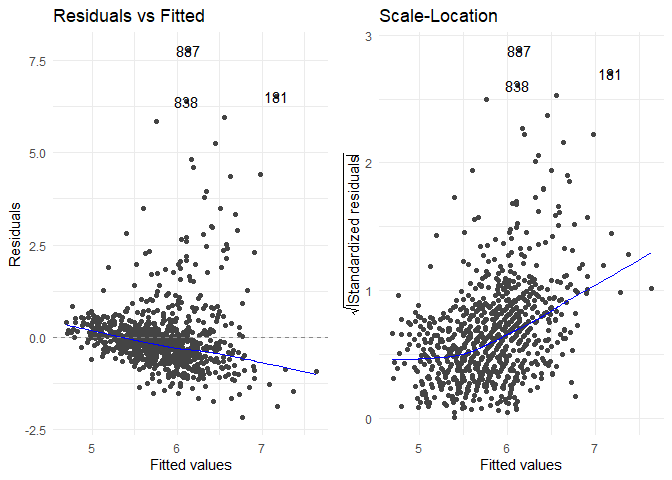<!-- -->

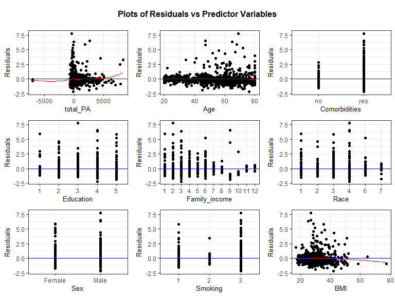<!-- -->

### Диагностика. QQ-plot и гистограмма

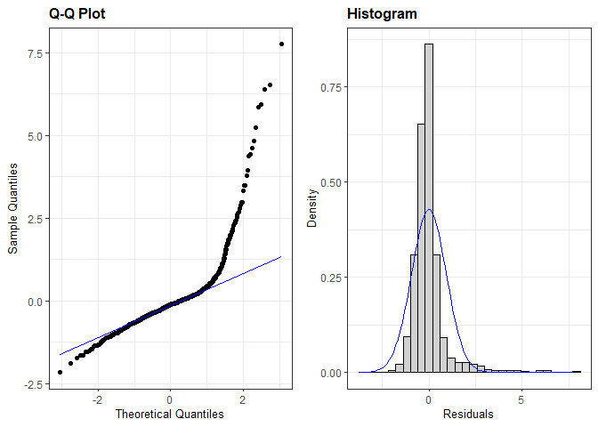<!-- -->

### Диагностика. Residuals vs Leverage

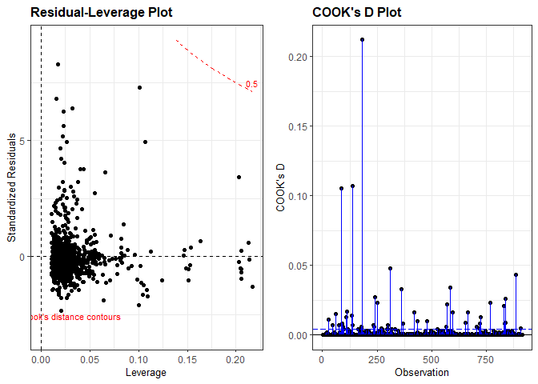<!-- -->

### Диагностика. Мультиколлинеарность:

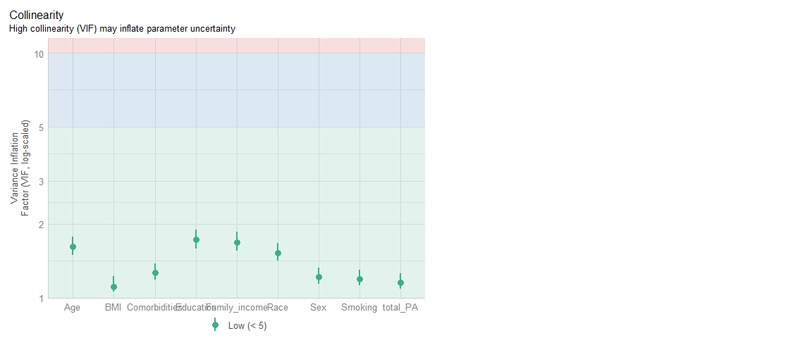<!-- -->

Коэффициенты корреляции Пирсона:


```
##             total_PA         Age        BMI
## total_PA  1.00000000 -0.26563450 0.01428083
## Age      -0.26563450  1.00000000 0.02099652
## BMI       0.01428083  0.02099652 1.00000000
```

*Выводы* Все паттерны и отклонения схожи с моделью изучения total эффекта физической активности, поэтому применим те же коррекции: удаление экстремальных значений у total_PA и трансформация этого предиктора с помощью логарифма.

## Модель с коррекцией

```
## 
## Call:
## lm(formula = gHg ~ log(total_PA + 1000, 0.1) + Age + Comorbidities + 
##     Education + Family_income + Race + Sex + Smoking + BMI, data = cleaned_data2 %>% 
##     filter(total_PA > -1000))
## 
## Coefficients:
##               (Intercept)  log(total_PA + 1000, 0.1)  
##                  3.902255                  -0.167934  
##                       Age           Comorbiditiesyes  
##                  0.013858                   0.326810  
##                Education2                 Education3  
##                 -0.106157                  -0.310416  
##                Education4                 Education5  
##                 -0.277341                  -0.332321  
##            Family_income2             Family_income3  
##                 -0.065885                  -0.040483  
##            Family_income4             Family_income5  
##                 -0.163709                  -0.061396  
##            Family_income6             Family_income7  
##                  0.001562                  -0.286629  
##            Family_income8             Family_income9  
##                 -0.473763                   1.080452  
##           Family_income10            Family_income11  
##                  0.818907                  -0.588858  
##           Family_income12                      Race2  
##                 -0.103270                  -0.101989  
##                     Race3                      Race4  
##                 -0.281712                   0.049146  
##                     Race6                      Race7  
##                  0.236690                  -0.317291  
##                   SexMale                   Smoking2  
##                  0.072003                  -0.121176  
##                  Smoking3                        BMI  
##                 -0.072782                   0.030305
```


```
## # A tibble: 28 × 7
##    term                 estimate std.error statistic  p.value conf.low conf.high
##    <chr>                   <dbl>     <dbl>     <dbl>    <dbl>    <dbl>     <dbl>
##  1 (Intercept)            3.90     0.459       8.51  7.34e-17  3.00       4.80  
##  2 log(total_PA + 1000…  -0.168    0.140      -1.20  2.29e- 1 -0.442      0.106 
##  3 Age                    0.0139   0.00203     6.82  1.73e-11  0.00987    0.0178
##  4 Comorbiditiesyes       0.327    0.0573      5.71  1.56e- 8  0.214      0.439 
##  5 Education2            -0.106    0.190      -0.560 5.76e- 1 -0.478      0.266 
##  6 Education3            -0.310    0.185      -1.68  9.32e- 2 -0.673      0.0521
##  7 Education4            -0.277    0.180      -1.54  1.23e- 1 -0.630      0.0756
##  8 Education5            -0.332    0.187      -1.77  7.65e- 2 -0.700      0.0354
##  9 Family_income2        -0.0659   0.120      -0.548 5.84e- 1 -0.302      0.170 
## 10 Family_income3        -0.0405   0.116      -0.349 7.27e- 1 -0.268      0.187 
## # ℹ 18 more rows
```

*Ответ* Прямой (direct) эффект физической активности на гликированный гемоглобин также является незначительным (нулевую гипотезу о нулевом прямом эффекте физической активности отвергнуть не можем). При этом индекс массы тела влияет на гликированный гемоглобин, коэффициент 0.03 (95% ДИ: 0.02-0.04, p < 0.05)
