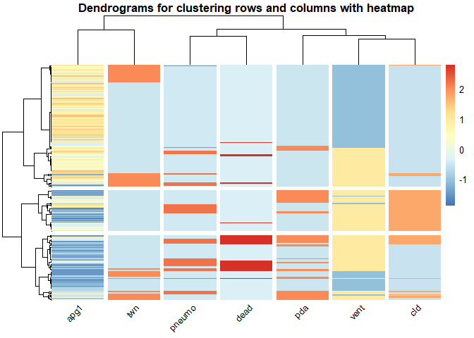

# 1. Загружаем и изучаем данные


```
##      birth            exit          hospstay            lowph      
##  Min.   :81.51   Min.   :68.53   Min.   :-6574.00   Min.   :6.530  
##  1st Qu.:83.52   1st Qu.:83.58   1st Qu.:   16.00   1st Qu.:7.130  
##  Median :84.90   Median :84.96   Median :   37.00   Median :7.210  
##  Mean   :84.75   Mean   :84.84   Mean   :   40.36   Mean   :7.202  
##  3rd Qu.:86.07   3rd Qu.:86.17   3rd Qu.:   62.00   3rd Qu.:7.310  
##  Max.   :87.48   Max.   :96.87   Max.   : 3668.00   Max.   :7.550  
##  NA's   :21      NA's   :31      NA's   :31         NA's   :62     
##      pltct                    race          bwt            gest      
##  Min.   : 16.0   black          :369   Min.   : 400   Min.   :22.00  
##  1st Qu.:143.0   native American: 16   1st Qu.: 900   1st Qu.:27.00  
##  Median :202.0   oriental       :  4   Median :1120   Median :29.00  
##  Mean   :201.6   white          :257   Mean   :1094   Mean   :28.87  
##  3rd Qu.:252.0   NA's           : 25   3rd Qu.:1310   3rd Qu.:31.00  
##  Max.   :571.0                         Max.   :1580   Max.   :40.00  
##  NA's   :70                            NA's   :2      NA's   :4      
##           inout          twn              lol             magsulf      
##  born at Duke:547   Min.   :0.0000   Min.   :  0.000   Min.   :0.0000  
##  transported :121   1st Qu.:0.0000   1st Qu.:  0.000   1st Qu.:0.0000  
##  NA's        :  3   Median :0.0000   Median :  3.500   Median :0.0000  
##                     Mean   :0.2074   Mean   :  8.438   Mean   :0.1344  
##                     3rd Qu.:0.0000   3rd Qu.:  9.000   3rd Qu.:0.0000  
##                     Max.   :1.0000   Max.   :192.000   Max.   :1.0000  
##                     NA's   :20       NA's   :381       NA's   :247     
##       meth             toc              delivery        apg1      
##  Min.   :0.0000   Min.   :0.0000   abdominal:314   Min.   :0.000  
##  1st Qu.:0.0000   1st Qu.:0.0000   vaginal  :335   1st Qu.:2.000  
##  Median :0.0000   Median :0.0000   NA's     : 22   Median :5.000  
##  Mean   :0.4372   Mean   :0.2248                   Mean   :4.903  
##  3rd Qu.:1.0000   3rd Qu.:0.0000                   3rd Qu.:7.000  
##  Max.   :1.0000   Max.   :1.0000                   Max.   :9.000  
##  NA's   :106      NA's   :106                      NA's   :34     
##       vent            pneumo            pda              cld        
##  Min.   :0.0000   Min.   :0.0000   Min.   :0.0000   Min.   :0.0000  
##  1st Qu.:0.0000   1st Qu.:0.0000   1st Qu.:0.0000   1st Qu.:0.0000  
##  Median :1.0000   Median :0.0000   Median :0.0000   Median :0.0000  
##  Mean   :0.5803   Mean   :0.1969   Mean   :0.2087   Mean   :0.2694  
##  3rd Qu.:1.0000   3rd Qu.:0.0000   3rd Qu.:0.0000   3rd Qu.:1.0000  
##  Max.   :1.0000   Max.   :1.0000   Max.   :1.0000   Max.   :1.0000  
##  NA's   :30       NA's   :26       NA's   :29       NA's   :66      
##        pvh            ivh            ipe           year           sex     
##  absent  :360   absent  :442   absent  :472   Min.   :81.51   female:320  
##  definite:125   definite: 75   definite: 38   1st Qu.:83.52   male  :330  
##  possible: 41   possible: 10   possible: 17   Median :84.91   NA's  : 21  
##  NA's    :145   NA's    :144   NA's    :144   Mean   :84.76               
##                                               3rd Qu.:86.07               
##                                               Max.   :87.48               
##                                               NA's   :21                  
##       dead              id       
##  Min.   :0.0000   Min.   :  1.0  
##  1st Qu.:0.0000   1st Qu.:168.5  
##  Median :0.0000   Median :336.0  
##  Mean   :0.2146   Mean   :336.0  
##  3rd Qu.:0.0000   3rd Qu.:503.5  
##  Max.   :1.0000   Max.   :671.0  
## 
```


Table: Data summary

|                         |           |
|:------------------------|:----------|
|Name                     |Piped data |
|Number of rows           |671        |
|Number of columns        |27         |
|_______________________  |           |
|Column type frequency:   |           |
|factor                   |7          |
|numeric                  |20         |
|________________________ |           |
|Group variables          |None       |


**Variable type: factor**

|skim_variable | n_missing| complete_rate|ordered | n_unique|top_counts                          |
|:-------------|---------:|-------------:|:-------|--------:|:-----------------------------------|
|race          |        25|          0.96|FALSE   |        4|bla: 369, whi: 257, nat: 16, ori: 4 |
|inout         |         3|          1.00|FALSE   |        2|bor: 547, tra: 121                  |
|delivery      |        22|          0.97|FALSE   |        2|vag: 335, abd: 314                  |
|pvh           |       145|          0.78|FALSE   |        3|abs: 360, def: 125, pos: 41         |
|ivh           |       144|          0.79|FALSE   |        3|abs: 442, def: 75, pos: 10          |
|ipe           |       144|          0.79|FALSE   |        3|abs: 472, def: 38, pos: 17          |
|sex           |        21|          0.97|FALSE   |        2|mal: 330, fem: 320                  |


**Variable type: numeric**

|skim_variable | n_missing| complete_rate|    mean|     sd|       p0|    p25|     p50|     p75|    p100|hist  |
|:-------------|---------:|-------------:|-------:|------:|--------:|------:|-------:|-------:|-------:|:-----|
|birth         |        21|          0.97|   84.75|   1.60|    81.51|  83.52|   84.90|   86.07|   87.48|▅▆▇▇▆ |
|exit          |        31|          0.95|   84.84|   1.79|    68.53|  83.58|   84.96|   86.17|   96.87|▁▁▇▅▁ |
|hospstay      |        31|          0.95|   40.36| 304.84| -6574.00|  16.00|   37.00|   62.00| 3668.00|▁▁▁▇▁ |
|lowph         |        62|          0.91|    7.20|   0.14|     6.53|   7.13|    7.21|    7.31|    7.55|▁▁▃▇▂ |
|pltct         |        70|          0.90|  201.62|  80.55|    16.00| 143.00|  202.00|  252.00|  571.00|▃▇▅▁▁ |
|bwt           |         2|          1.00| 1093.89| 265.22|   400.00| 900.00| 1120.00| 1310.00| 1580.00|▂▅▆▇▅ |
|gest          |         4|          0.99|   28.87|   2.55|    22.00|  27.00|   29.00|   31.00|   40.00|▂▇▆▁▁ |
|twn           |        20|          0.97|    0.21|   0.41|     0.00|   0.00|    0.00|    0.00|    1.00|▇▁▁▁▂ |
|lol           |       381|          0.43|    8.44|  19.26|     0.00|   0.00|    3.50|    9.00|  192.00|▇▁▁▁▁ |
|magsulf       |       247|          0.63|    0.13|   0.34|     0.00|   0.00|    0.00|    0.00|    1.00|▇▁▁▁▁ |
|meth          |       106|          0.84|    0.44|   0.50|     0.00|   0.00|    0.00|    1.00|    1.00|▇▁▁▁▆ |
|toc           |       106|          0.84|    0.22|   0.42|     0.00|   0.00|    0.00|    0.00|    1.00|▇▁▁▁▂ |
|apg1          |        34|          0.95|    4.90|   2.63|     0.00|   2.00|    5.00|    7.00|    9.00|▅▆▆▇▇ |
|vent          |        30|          0.96|    0.58|   0.49|     0.00|   0.00|    1.00|    1.00|    1.00|▆▁▁▁▇ |
|pneumo        |        26|          0.96|    0.20|   0.40|     0.00|   0.00|    0.00|    0.00|    1.00|▇▁▁▁▂ |
|pda           |        29|          0.96|    0.21|   0.41|     0.00|   0.00|    0.00|    0.00|    1.00|▇▁▁▁▂ |
|cld           |        66|          0.90|    0.27|   0.44|     0.00|   0.00|    0.00|    1.00|    1.00|▇▁▁▁▃ |
|year          |        21|          0.97|   84.76|   1.60|    81.51|  83.52|   84.91|   86.07|   87.48|▅▆▇▇▆ |
|dead          |         0|          1.00|    0.21|   0.41|     0.00|   0.00|    0.00|    0.00|    1.00|▇▁▁▁▂ |
|id            |         0|          1.00|  336.00| 193.85|     1.00| 168.50|  336.00|  503.50|  671.00|▇▇▇▇▇ |

## 1.1 Удаление колонок с пропусками больше 100, затем строк с пропущенными значениями


Table: Data summary

|                         |           |
|:------------------------|:----------|
|Name                     |Piped data |
|Number of rows           |531        |
|Number of columns        |20         |
|_______________________  |           |
|Column type frequency:   |           |
|factor                   |4          |
|numeric                  |16         |
|________________________ |           |
|Group variables          |None       |


**Variable type: factor**

|skim_variable | n_missing| complete_rate|ordered | n_unique|top_counts                          |
|:-------------|---------:|-------------:|:-------|--------:|:-----------------------------------|
|race          |         0|             1|FALSE   |        4|bla: 303, whi: 211, nat: 13, ori: 4 |
|inout         |         0|             1|FALSE   |        2|bor: 448, tra: 83                   |
|delivery      |         0|             1|FALSE   |        2|vag: 269, abd: 262                  |
|sex           |         0|             1|FALSE   |        2|mal: 267, fem: 264                  |


**Variable type: numeric**

|skim_variable | n_missing| complete_rate|    mean|     sd|      p0|    p25|     p50|     p75|    p100|hist  |
|:-------------|---------:|-------------:|-------:|------:|-------:|------:|-------:|-------:|-------:|:-----|
|birth         |         0|             1|   84.63|   1.54|   81.51|  83.43|   84.77|   85.83|   87.48|▅▆▇▇▅ |
|exit          |         0|             1|   84.76|   1.55|   81.05|  83.56|   84.87|   85.99|   87.72|▂▆▇▇▅ |
|hospstay      |         0|             1|   47.04|  63.50| -295.00|  21.00|   40.00|   64.00|  797.00|▁▇▁▁▁ |
|lowph         |         0|             1|    7.22|   0.13|    6.53|   7.13|    7.22|    7.32|    7.55|▁▁▃▇▂ |
|pltct         |         0|             1|  204.49|  80.83|   16.00| 148.00|  204.00|  256.00|  571.00|▂▇▅▁▁ |
|bwt           |         0|             1| 1135.61| 240.04|  400.00| 960.00| 1160.00| 1330.00| 1500.00|▁▃▆▇▇ |
|gest          |         0|             1|   29.25|   2.21|   23.00|  28.00|   29.00|   31.00|   36.00|▁▇▇▆▁ |
|twn           |         0|             1|    0.21|   0.40|    0.00|   0.00|    0.00|    0.00|    1.00|▇▁▁▁▂ |
|apg1          |         0|             1|    5.02|   2.65|    0.00|   2.00|    5.00|    7.00|    9.00|▅▆▅▇▇ |
|vent          |         0|             1|    0.54|   0.50|    0.00|   0.00|    1.00|    1.00|    1.00|▇▁▁▁▇ |
|pneumo        |         0|             1|    0.18|   0.38|    0.00|   0.00|    0.00|    0.00|    1.00|▇▁▁▁▂ |
|pda           |         0|             1|    0.20|   0.40|    0.00|   0.00|    0.00|    0.00|    1.00|▇▁▁▁▂ |
|cld           |         0|             1|    0.26|   0.44|    0.00|   0.00|    0.00|    1.00|    1.00|▇▁▁▁▃ |
|year          |         0|             1|   84.63|   1.54|   81.51|  83.43|   84.77|   85.83|   87.48|▅▆▇▇▅ |
|dead          |         0|             1|    0.12|   0.33|    0.00|   0.00|    0.00|    0.00|    1.00|▇▁▁▁▁ |
|id            |         0|             1|  328.66| 183.38|    2.00| 175.00|  329.00|  479.50|  671.00|▇▇▇▇▆ |

# 2. Графики плотности распределения. Удаление выбросов

Сначала конвертируем переменные twn, apg1, vent, pneumo, pda, cld, dead, id в факторы.


Table: Data summary

|                         |           |
|:------------------------|:----------|
|Name                     |Piped data |
|Number of rows           |531        |
|Number of columns        |20         |
|_______________________  |           |
|Column type frequency:   |           |
|factor                   |12         |
|numeric                  |8          |
|________________________ |           |
|Group variables          |None       |


**Variable type: factor**

|skim_variable | n_missing| complete_rate|ordered | n_unique|top_counts                          |
|:-------------|---------:|-------------:|:-------|--------:|:-----------------------------------|
|race          |         0|             1|FALSE   |        4|bla: 303, whi: 211, nat: 13, ori: 4 |
|inout         |         0|             1|FALSE   |        2|bor: 448, tra: 83                   |
|twn           |         0|             1|FALSE   |        2|0: 422, 1: 109                      |
|delivery      |         0|             1|FALSE   |        2|vag: 269, abd: 262                  |
|apg1          |         0|             1|FALSE   |       10|8: 91, 1: 74, 6: 70, 7: 69          |
|vent          |         0|             1|FALSE   |        2|1: 288, 0: 243                      |
|pneumo        |         0|             1|FALSE   |        2|0: 438, 1: 93                       |
|pda           |         0|             1|FALSE   |        2|0: 425, 1: 106                      |
|cld           |         0|             1|FALSE   |        2|0: 393, 1: 138                      |
|sex           |         0|             1|FALSE   |        2|mal: 267, fem: 264                  |
|dead          |         0|             1|FALSE   |        2|0: 467, 1: 64                       |
|id            |         0|             1|FALSE   |      531|2: 1, 4: 1, 5: 1, 7: 1              |


**Variable type: numeric**

|skim_variable | n_missing| complete_rate|    mean|     sd|      p0|    p25|     p50|     p75|    p100|hist  |
|:-------------|---------:|-------------:|-------:|------:|-------:|------:|-------:|-------:|-------:|:-----|
|birth         |         0|             1|   84.63|   1.54|   81.51|  83.43|   84.77|   85.83|   87.48|▅▆▇▇▅ |
|exit          |         0|             1|   84.76|   1.55|   81.05|  83.56|   84.87|   85.99|   87.72|▂▆▇▇▅ |
|hospstay      |         0|             1|   47.04|  63.50| -295.00|  21.00|   40.00|   64.00|  797.00|▁▇▁▁▁ |
|lowph         |         0|             1|    7.22|   0.13|    6.53|   7.13|    7.22|    7.32|    7.55|▁▁▃▇▂ |
|pltct         |         0|             1|  204.49|  80.83|   16.00| 148.00|  204.00|  256.00|  571.00|▂▇▅▁▁ |
|bwt           |         0|             1| 1135.61| 240.04|  400.00| 960.00| 1160.00| 1330.00| 1500.00|▁▃▆▇▇ |
|gest          |         0|             1|   29.25|   2.21|   23.00|  28.00|   29.00|   31.00|   36.00|▁▇▇▆▁ |
|year          |         0|             1|   84.63|   1.54|   81.51|  83.43|   84.77|   85.83|   87.48|▅▆▇▇▅ |

```
## [1] "Построим графики плотности распределения количественных переменных"
```

<!-- -->


*Явные выбросы у переменной hospstay: отрицательные значения и значения больше 300 . Удалим их.*


Раскрасим графики плотности по переменной ‘inout’.

<!-- -->

# 3. Тест на сравнение значений колонки ‘lowph’ между группами в переменной inout.

Выбран t_test с методом Уэлча, т.к. минимальное количество в группе 80 и дисперсии неизвестны .


```
## # A tibble: 1 × 8
##   .y.   group1       group2         n1    n2 statistic    df           p
## * <chr> <chr>        <chr>       <int> <int>     <dbl> <dbl>       <dbl>
## 1 lowph born at Duke transported   438    80      5.32  107. 0.000000588
```

```
## 
## 	Welch Two Sample t-test
## 
## data:  cleaned_data_1$lowph by cleaned_data_1$inout
## t = 5.3159, df = 106.63, p-value = 5.876e-07
## alternative hypothesis: true difference in means between group born at Duke and group transported is not equal to 0
## 95 percent confidence interval:
##  0.05424374 0.11876292
## sample estimates:
## mean in group born at Duke  mean in group transported 
##                   7.230751                   7.144248
```

*Интерпретация:* т.к. среднее в группе transported ниже, то можно предположить, что в данной группе более низкая выживаемость.

# 4.Новый датафрейм

## 4.1 с континуальными данными. Корреляционный анализ.

<!-- --><!-- -->

## 4.2 с ранговыми данными. Корреляционный анализ.

<!-- --><!-- -->

# 5. Иерархическая кластеризация

## 5.1 Континуальные данные


```
## $hopkins_stat
## [1] 0.7904047
```

Оценим кластеризацию:
 

```
## [1] 0.62383
```

<!-- -->
 
 
 
## 5.2 Ранговые данные


```
## $hopkins_stat
## [1] 0.8273205
```

Оценим кластеризацию:
 

```
## [1] 0.728013
```

  
<!-- -->


# 6 Heatmap

## 6.1 Континуальные данные

<!-- -->

*Интерпретация:* Длительное пребывание в госпитале ассоциировано с низким весом при рождении и ранними родами.

## 6.2 Ранговые данные

<!-- -->

*Интерпретация:* В группе со смертельным исходом более низкий балл по шкале апгар, шкала апгар не ассоциирована с количеством рожденных детей.

# 7. PCA

## 7.1 Континуальные данные


```
## Importance of components:
##                          PC1    PC2    PC3    PC4     PC5
## Standard deviation     1.536 0.9965 0.8910 0.7655 0.51689
## Proportion of Variance 0.472 0.1986 0.1588 0.1172 0.05343
## Cumulative Proportion  0.472 0.6706 0.8294 0.9466 1.00000
```

<!-- --><!-- --><!-- --><!-- --><!-- -->

*Интерпретация:* 3 компоненты обуславливают 83% дисперсии данных. В первую компоненту основной вклад вносят переменные: вес и гестационный возраст при рождении; во вторую компоненту основной вклад вносят число тромбоцитов; в третью компоненту основной вклад вносит минимальное значение pH и срок госпитализации.

# 8. PCA график

<!-- -->

# 9. PCA график plotly


```{=html}
<div class="plotly html-widget html-fill-item" id="htmlwidget-ff06145897385a6e3225" style="width:960px;height:960px;"></div>
<script type="application/json" data-for="htmlwidget-ff06145897385a6e3225">{"x":{"data":[{"x":[-1.8462330069520736,-1.5577829559436502,-1.060086027701455,-1.5031270856033767,-0.72111918396321839,0.70093693710508431,-0.67027954482096874,1.8973309556203568,-1.4350311311528785,-0.80189702964588272,-0.17024384067258908,0.59196370222279493,0.52298573616306465,2.6335210155433848,-0.087539117049103068,-1.101207316621154,-0.16391039490894016,0.73915131500397491,-1.59619819555718,-0.7640343047019541,0.92386773236437469,-1.3041157113818864,1.0108358666571429,0.14691207379869742,-0.062257167641693818,0.44188069413703202,-1.1250756001093574,-0.27740267045181771,0.20182204247872457,-0.8901851018639112,0.55204896804876158,2.4582044229177287,1.7240173842363793,-0.045737768972175637,0.54262518927263648,-0.31052533421476741,-1.4427266184517213,0.69436753916662741,0.22778442380851815,1.7329999661801592,-1.7972095022293428,-1.7815281077147551,-0.93552258986569503,0.080538238713212917,1.3043050517587855,1.2363092330521983,-1.3655612333460914,-1.1330976067478629,0.16372616682043181,-1.4885162481948875,1.6159213055750539,-0.46886821448123212,-0.94266049912736338,0.42959314279113353,2.3557939865520479,-1.4317092530303128,0.65683643387281787,0.44212776456526831,0.15692960014328586,-0.26073848756272539,-0.084728012761540641,1.6072481233173974,-0.0026982483575272807,4.3736329940879513,-2.0293932993762196,-2.2231261456254465,-0.63582178612015428,-0.94311658959972178,-1.2196077140740189,1.0754490907362022,0.99183909151366068,-1.1853269715762142,-1.6479863638469106,2.0805596452585728,-0.030664130994755505,0.14940156161796442,-0.83800557447913093,-0.98352442749696767,-1.8515521599665705,-1.2157286824423712,1.0576732482429434,0.60134413022544519,-0.16766795665791615,-1.0602443848247578,2.0890317794726023,1.2053669098780224,1.7461212441536444,0.93145220932512029,1.3176075575835149,-1.7129811792706722,-1.0790001310416057,-0.43916539745259003,2.9891245129964941,-1.1184438084203123,1.3639914019003581,-0.78336423116880105,-0.82471441366777032,0.26306080278904359,-0.61437485764313715,-0.19484373767509366,0.071860013466059761,0.75947269432105013,0.37608342490986113,0.75370409097762114,-1.0179297227005313,-0.33528682522622733,-0.4326762661901104,-0.44921130810237914,-1.5761300037597108,1.2943878399403201,-0.32405704629077237,-1.2417297257544138,0.94744131487453265,-1.1768561777826754,1.2862297170209145,2.7543862747609107,-0.2633832617216163,-0.33538145433569938,0.11593128813340794,-0.69082552836569056,-0.60477045440038235,2.4332511666817602,-1.8149515669224696,0.058788594732110185,-0.43578712415913229,-0.80360231347670452,-0.49145287883951955,-0.63975825745508452,0.57021461411233609,-2.0847553501823541,1.7686994648312346,-0.96859914500901512,2.091132588621718,0.71039178622636556,-0.56237902420975139,-1.8253127177929986,0.84923228143157503,-1.6833411253095456,-0.17150594849392645,-0.77182132289698013,-0.80807962003153488,2.9603365671419573,-2.017617701804657,-2.1689827879110868,-0.0084306671637638959,-0.61723270379303885,0.90525138603752542,-0.64340557262796882,0.5144901303490278,-0.033910024077620823,-1.7203590646891367,-1.8914284644038519,-1.4181590834616711,-0.99395531949802762,0.16746759471238584,1.2824748643556099,1.332105641996348,2.3257455879750171,0.51871094829962638,-0.11407372728289113,-1.6294772808400364,0.77447597221391706,3.76205203172568,-1.7288874706810993,1.1020946412882879,1.7437731762048616,-1.8036558749803313,0.044446041092819057,-1.4884507702383734,-0.28016976016185396,-2.516642975009693,0.81913339255868556,-2.0046404168833094,-1.6691417297228954,-1.210903666976932,-0.19205168108188109,-1.9696321783279227,-1.8684548335573592,-2.407317352736865,-0.1170120343531971,0.15253766144141859,-1.1455915402633527,0.97472017929340149,0.13643273752111967,-0.079061329143421816,-1.7985338515584159,1.7751081356645186,2.4763948558973636,-1.1024015396972346,-1.6545171289467304,-0.20468189346124155,-0.67826423051825446,-1.6102733858060638,-3.2021221401899318,-1.5578418984384379,-1.5293855058700663,1.3478045748714169,-1.2444381236751734,-1.5204579197857166,2.7901376478288848,1.1530827810326645,0.3493653713171207,-0.98714509732381939,-2.0846471326685005,-1.1805673686669784,-2.522590087765384,1.7248797801612199,-1.6815500634605427,-1.136735932668596,-0.82378974733446564,-0.043000995187272836,1.549673383177667,-0.19340929032739723,-1.9462499983482393,-1.2057687742146053,-2.1689602631066025,-3.4035745595788303,-0.88072953592092296,0.36459616216116353,-2.3375155808248951,0.054944672975122733,-0.32518705152484118,-1.2550664961393785,-0.53033540564682191,1.6636839834768171,0.84730449871540192,0.1936509392478061,-0.14250440433696418,-2.2317225404627208,-0.68939480805817943,-1.5810446253044634,2.8308403418381189,1.8218559091001767,-1.5473353416645106,-1.925080848383254,-2.0271549484120501,-2.2803042216818974,1.5342056219789364,-1.4447768216299748,1.7124174850909004,0.87413333804105453,1.1367246440025491,1.012474500278004,-1.4762630189687169,-1.0516370741712175,0.76372752033033831,-1.0743865380665172,-2.258346492381778,-0.76589480998359261,1.5092938863210903,3.1183759273276555,-0.69024947108659229,1.1822365446461653,2.9698187872924704,2.4431991162532452,-0.022200352775114143,0.13539694747478348,1.1676846405667862,-1.9359409003084664,-0.38268146024371613,-0.7564915608970495,1.8164198148721282,0.32437314820322566,-0.71015307411187889,-0.39118061902659645,1.8058604997273315,0.15839225453978753,-1.6959774350576307,-2.4327818302313617,1.8335474960939391,1.1059912592827694,-1.6777925841276682,-0.77370451427429865,-0.39949655492725661,1.4741494274050442,-0.78599969103979239,4.8727584574532017,1.7481555751060327,1.6571843115203282,2.1355706650708624,-0.57070701090678189,0.13047627232400849,-1.2769323904367407,3.7617893345671756,-1.8574762665760569,-0.92256797143354985,-0.87252297753472896,0.9563892331836541,-0.51625638304279498,0.3170212301541403,-1.1152638420494878,-2.3603090329359122,0.79206364610330593,1.3587689774232634,-1.943443007059485,-1.2064854931812818,-1.6367179395285905,1.9906163669131256,1.0615604414925759,-2.2852664571123,1.2271852395694638,-1.8434194459243449,1.6852151582754324,0.60211592239850364,-0.58322643457837986,0.958971591708358,-0.58094103001025532,-0.32557030007469062,-1.6864374643447195,-1.4640172102513935,1.1875623901302055,-1.3675366766470289,1.3536540412652782,-3.1092489843365101,0.10619444251656586,-1.2699947124645963,-2.1809746686228482,-1.9477532740361725,2.1630815772832621,0.82603437437113958,0.047464152101773217,-1.7736596684867316,-1.6699837163697429,-1.1566747458160564,-1.5407375970700092,-2.111586364098986,-0.36974335705235695,-0.56383407146508524,1.0027484632186925,-0.79561418551754737,-0.8721579471834201,-1.8718212568593777,-1.5694664428341729,-2.1931302063196414,-2.3389190561905946,-0.44300441848162558,-1.4455488513212853,1.1025852130561125,-0.26039675512346738,0.76423357097418565,-1.0201032762662281,-1.2783788148486468,-2.1102844868504658,-0.45022252110351818,-2.0735253346018521,2.7287050250270815,-0.69682359861248011,0.36292022426295345,1.3991526447638334,1.4482560951885941,1.3702622926411363,1.8723146341376682,1.1707799141933271,-1.2765569773319621,2.2032817504439626,1.6197708792351178,2.6977609404930574,-1.3119319196041499,0.34402553593734936,0.92170132892710155,-1.0825045733397012,1.0718704615007224,-2.4637778694144856,-2.0427645427251164,-1.1641081699600317,-0.98781923520410908,-0.33491650273316526,0.8303349872638105,0.57741645350748005,-1.3295331170686258,-1.8765235657954162,1.009079553589477,-2.911486626611036,-2.5620564875326628,1.4290879378101622,-0.026495425247302209,2.4825835017403701,-1.6948016087093454,-1.699586417264054,-1.2369756954354492,-1.4643211715400677,0.2869645624540838,-1.4860937141705737,0.69450941368175834,3.6167221011713884,0.19242992210400539,-1.9790278913212258,-1.7375350293260046,-1.3361626104562141,2.2356737527029114,-0.91643381816862635,1.384186777431947,-1.6914244516224965,-2.3521750099553085,2.0276744347351432,3.1118266430013599,1.2539495656252808,-1.5276206721723478,-1.4711164772627585,-1.5623521549833157,-2.4449348799258113,-1.257974563907716,0.39467807480667649,0.90030807970819515,0.54041919856057341,1.6740474335564162,-0.48281163912120689,-2.0842578719775955,-2.318833753950845,-1.2828895835433327,-0.31812299789803428,-1.4351148174634212,-2.2701651197395378,-1.7625157892793455,0.62743012171939805,2.9056718830551898,-0.79843654595897029,-1.7951835627595483,3.0513086546750681,-2.3159392583561753,-1.749345414839768,-1.5121981963360005,1.0262292594776117,-0.020667667203745851,-0.021736094045614593,-0.38831664873672322,0.091337621865201418,0.58558499348504345,0.36764128748501823,0.53157935856114258,-0.2754851809127391,3.0102166680966964,-1.3489980388927045,-0.82871993018063628,0.17222240914322196,-0.11561128309301216,1.1510431736854818,-0.87401088182347264,-0.64717181844952421,0.18801169701531503,-1.3830834958164422,-0.23718841742321503,0.56103061014882072,-1.0221003567564733,2.3448750709333579,1.2626526852997357,-3.0840178410401604,3.2685624932050295,1.7222360825424428,-0.78891628220340593,-0.59892872184231949,-0.85732923158261665,0.87683387623861053,-0.16242489640778618,-1.0461388901161628,0.52024494310309699,-0.81537159340725407,1.5858839764920656,1.2269144659052604],"y":[-0.28400397786393899,-0.86805498585995566,0.8703553016767086,-1.6824264965281255,-0.82116899800780407,-0.053651459286846691,2.3953827407603581,1.5467650061591218,-1.2909498499762517,0.10763705391277069,-0.95503357152876023,-0.25952280338328421,0.16567127321121919,-0.52116169938303769,0.18910768809400974,-0.64630135778403175,0.33808377913154197,0.09104288133808433,0.60110810914191393,0.21819003897920344,2.4370633974927718,0.40382390483866498,-1.5095849558863814,-1.4153088791521162,0.57926475904188035,0.045805053256623915,-1.9906551687903713,-0.62984232327215917,-0.21387398821154732,0.26686532206139646,-0.10150435271543037,-0.81060130497295846,1.2671646064232625,-0.34497936102194671,-0.33150195173883901,0.084343679682298431,-0.15782167922861315,1.0862186567683088,-0.47956572307787299,0.80290292935677154,-0.61773613719642428,3.0347004355360276,1.2335937548499716,0.70986911078720449,0.11225138772931315,-0.67674950320697869,-0.5628387122694305,0.57527835330525001,2.304877895415169,-0.077562351657521997,1.2943276619392503,-1.1215590322095859,-2.1259269423376272,-0.72658209051753742,-0.31284098978014702,-0.04594506086577483,-2.8292834683280375,-1.2812034068913614,-0.49330860866053511,-0.70287790215593648,-0.35127071259218579,1.3708362074419855,-0.063132532247245146,-1.4200104797404569,-0.38059119147144183,0.099172342716946804,1.229518900166878,-0.27542288721445879,-0.77520447139190096,0.85780520230468482,1.2276759712550325,1.1851551670029332,0.0092076426186058456,-0.10365611035147733,0.80956318699438623,0.21147016367176619,1.197632576202641,-0.095646340787215442,0.49100201593423087,-0.16166974809084114,0.16467229149802839,0.57825825331268432,1.9492188616047528,1.0889437915174822,0.46704393694239765,-0.31868725421153815,0.13061065377731049,-0.34043570547782886,0.15762876466094744,0.69388145439664428,-0.32033520008380234,-0.67280552423144924,-0.17550366231018558,-0.65761875446983598,-0.20003631385340445,-0.9353092883633598,-0.69080487776692834,-0.71044929693804604,1.8466639732710164,2.1639401270129679,0.35249510176609938,0.17126326522323793,0.8401060976873691,0.65874631247250603,1.4405745363589919,3.1767167330670913,0.67182829414953416,0.29032360910321209,0.90880267740765597,1.0056815259896685,-0.13304930999454612,-0.25604428208618019,-2.0355603448652326,1.658972067985635,0.66993072519366748,-0.2832609159558136,-0.14529659434620024,0.75360386730944762,-0.75415959869134341,-1.2215282221496711,0.92773261918176997,0.8958261095029596,-0.58786791920111159,-0.1372631112640976,-1.0206656383308153,-0.049072745706286239,-1.2975265938694276,-0.11102874347318653,0.98711575442064503,0.12870607554700095,0.67046950253552029,0.29958569605185653,-1.0514384019381702,-1.685014373606621,2.0813500584192473,-0.36303185618292871,0.46192387261911788,0.98932576145503692,-0.50568527194975077,0.73597752138242223,-1.7254249458109039,0.29268412041773884,-0.085025787069331518,-1.2985784365319162,-0.2003437729374721,-0.25465699748685156,0.093683324700279708,-0.8303642614099368,-1.2740809580026808,-2.0155894527721152,0.01840419398527637,-0.59458935711780181,0.83541559422312561,-1.4118321187318994,-1.5823231022986313,-2.0105397317102698,0.72605913407325628,0.18575516461121469,0.7469416460042434,0.68868924588763614,0.27432639963362349,-0.68695310722773195,0.54632398506659086,1.9830807513676425,-0.93183911966303612,-0.23532744968688024,1.1405699419905087,1.6863302731767493,-0.67421353572768417,0.36123368089173841,1.3976247081752295,-1.7331092470040352,0.28373459296574494,-0.24155418284966432,-0.65763439552310299,0.54968501787100121,1.9444707050088947,-0.71180738449599534,1.5604892434979536,-0.28462370034902318,0.18767365598692781,-0.092858014116949231,0.66766795674474311,-0.036945838120878823,-0.6390916790373703,-1.1914655265329499,-0.19046024566129943,-0.37972737484597774,0.66815031314352913,-0.89420966876922714,-0.92989009725220151,0.42989896129585659,-0.099338547017501083,0.92496863827036779,-0.28333734477902156,-0.033905750823815847,-1.9372011492542129,-0.097574199420485785,-0.3030202090300339,0.021890597312617926,0.77911665310308165,0.69083176684295988,-0.23827080310505983,-0.80124337072192209,0.59872898427553889,0.29748836037747983,0.59805348065077468,-0.99553129454438039,-0.63434803150091368,1.6988823820633279,0.88040233606640506,0.48753339875415125,-0.87799129172411561,0.7193548985828041,-0.54348417368372248,-0.64151396109814685,0.29180767840776417,1.9416688475755599,-0.17260682217338755,0.22649316419945179,0.5439680921662271,1.5538599515530302,0.078461829850446044,0.30051015094757472,-0.1993961076134621,-0.10942141828436598,-0.12759169805198348,-1.5168092032643474,-0.51344238605615178,-0.36168325451793881,-2.2454263285368494,-0.81320785598956624,0.83964131333125436,1.1765281342286698,0.11800583492931696,-0.34603720213108502,-1.5665937752527757,1.6801213201711298,-0.62265357936177534,0.24781949206654497,0.38128092364664462,-1.5769761630993131,0.37646299781212206,0.52419852958831836,1.0188182098069585,-1.073669724106934,-0.062741949015274953,0.79384512422784459,-1.9336596752015469,-0.73796403121639242,0.92725332284073525,-0.52820713605384972,0.95244464709312449,-0.71352469030553001,1.2924240137878451,1.1077180575894812,0.05297628213591437,-0.17260483234876084,1.3674853364960857,0.99079874017363778,-0.32028316046555616,-0.36327205809303265,-0.57656803315125393,-0.1367374573323224,0.45045459536308924,-0.84231338370381559,1.0610987730696326,-1.4447407207164629,-0.31506219176157929,-0.3139026234904419,-1.2866360554717327,-0.5208602107164394,-0.81212824027809072,0.13729262602770553,-0.1866132440290503,-1.7892097065743675,-0.53298655405365447,1.4129930117067975,0.36075820942047093,0.22877460796883362,-0.42540208896933596,-0.84512342457269107,-0.70028610479213693,0.24676503520342757,0.73382912634162778,0.098729231919993957,1.2156991355850315,1.9131055775554762,0.83554426387710812,-1.6600561475210456,-0.155699640747959,-0.18626357853079117,0.68404618890048574,1.2762796007750217,0.11457398562361602,-0.84568391650548025,-0.42899101470325873,-0.5305534175163501,-0.42597616238409625,1.200189014729051,1.9166791882934151,0.60862965284207693,0.54109506958984066,-1.0635279873325505,-0.88089782763522573,0.36096936126000628,1.05742777253403,-0.43758443580225964,-1.4698184404608219,2.902195874969717,-0.91482453527523633,-0.53325077668580922,0.46738584091862345,1.0788050373005691,-1.0790977613659101,0.6979997510256637,-0.11865753220955466,-1.0397307703136975,0.17899404672529212,-1.1443394086660901,1.2088950284864124,0.23564910424813068,1.0004620026321442,-0.67822904122114558,-0.42580569042130417,0.30327047822747238,-0.18967020928564676,0.62949972526367515,0.11811162723696883,-1.9481621822805397,-0.78992995390899567,0.024608546519354249,0.2820547014999002,0.55697746327939424,0.46076433752064422,0.55303146070028331,-0.7609691515386906,1.7086065963637582,0.20108086916248125,0.95344399193816953,1.4367841922562474,0.96359715355344056,0.57158421450301367,-0.61925095433173383,0.49454910689825721,-0.76907131855142696,0.24656839501658295,-0.59577679914566417,-0.39813346019807644,-0.81013372329797129,-0.19944762171004571,1.0459667433308499,-0.3769992053036324,-0.080891773061673083,0.56577822127970534,-1.9141316172178853,-0.080862525838276023,-0.44982558366179554,-1.5670800513081566,-0.25923980733054447,-1.2201044760651603,-1.1471631831734213,-0.78400713775958109,-1.1470268968911885,0.34018274860865849,0.2440857587790693,0.50773996546199873,0.5116771881610499,1.4985518755968699,-1.0932881834910624,0.86010246679653268,2.510629374284155,0.34278729103029953,0.60013909855070535,1.4109220399571925,1.4739840283737218,-0.55054269998004846,0.47420892694150207,0.20980434161278538,0.48204036486070717,-0.5542817394533931,0.26002173964360159,-0.24507380369453008,-0.60752122333898384,-0.37196541018792473,-0.51675463039611869,0.45647279438771904,0.48805602834498024,-0.15397710349263127,2.2247307139829333,-0.84884463629710982,-0.20862889782243296,-1.0091170721766098,-0.39533675311387856,0.95170073521847343,0.29205025529790818,-0.12491784133387364,-0.62509276975776162,-1.1457627924109848,0.88996361655611722,0.66755535899067686,-0.43906759142784479,-0.87391201992812728,-1.75093724170225,0.39011460771599193,-0.37264859746943868,0.2969222997740173,1.2910742048710291,1.2645466443723474,-0.6575204161234347,1.4394925750039504,-0.37005479930381352,-1.49826120105307,-0.36297327205410368,0.64114059693260861,-0.99963207198044368,1.0956999584314104,0.19137220865665305,0.16146231404684833,0.98748438340819777,-1.1403772416912283,-0.8221545184867024,1.9722801323446264,-0.13468601355808391,-0.97251106386627173,-1.2854720621304603,-1.5207169269764722,-1.3806301601058795,0.90952470207076319,1.8811979659133158,-1.2863728496446325,-0.97986870690905425,0.054029570588896965,0.34033021206599012,-1.0392430393500069,-0.23280573886410599,-1.5911547607281475,-0.1163892034626467,-0.7479454180411923,-0.43935974913231546,-0.18833409944583535,1.4534722055300906,2.012310372798046,-2.3690434597427008,1.9999307688348158,-1.7908759987183933,-0.94115493464925259,1.4357099049241711,0.24026831914644411,-0.97946331744347837,-1.2939643738568156,0.26322849796764136,2.4883352685733588,-0.46530737664490018,-0.69692496311407504,1.0738733196766357,-0.76291260729899224,1.6994566517430487,-0.35693801054291524],"text":"","type":"scatter","mode":"markers","marker":{"autocolorscale":false,"color":"rgba(248,118,109,1)","opacity":0.20000000000000001,"size":5.6692913385826778,"symbol":"circle","line":{"width":1.8897637795275593,"color":"rgba(248,118,109,1)"}},"hoveron":"points","name":"0","legendgroup":1,"showlegend":true,"xaxis":"x","yaxis":"y","hoverinfo":"text","frame":null},{"x":[1.4996397943336794,-0.10985742122137519,0.092536432084793063,1.510296230513299,-0.4984535501281202,-0.44058931980734817,-0.64050892474635823,0.46966930423796244,0.83467855971843152,3.7791055858295022,0.39574828268391415,2.1082358984431697,0.39681235017017202,0.22794153125895839,0.99471862859393367,0.47215480879681992,0.99417613118118564,0.51856691035507496,0.72130751654135217,1.0840018879654945,0.016290875676246496,2.2656896426042206,2.8028483728151494,-0.45966348108542948,2.9427234674990359,1.6838539034235873,1.9256854819403546,1.4151015421358446,1.9053793039311613,1.2848664249016999,1.2521647266865181,1.707492390065346,1.9455825456713489,1.0269338132775834,-0.40783914812026967,-0.092479194169373849,3.3428979096735856,-0.19135111387267806,1.3704613084700319,3.2648631168791544,1.2130803565871231,2.5702651477303151,0.49948271527912474,1.7898566311746189,2.6119834523402576,3.2270689165721369,3.3462780242650547,1.2857441402512135,-0.30417744427011445,2.8985479740404565,1.7222576403752328,4.906446198463259,3.785901728135812,-0.72977411067032971,2.11370270013416,1.100466241001393,3.1499210987731217,2.6343138138830415,2.6563067741784794],"y":[-2.043353426209737,1.6468338487132412,0.87802214093266051,-0.30695625471803439,0.15594318510115884,-0.1483863755236022,-0.3055994368195582,-1.8465758296946975,-0.56463852793182345,0.59580891966748706,-0.96379082276370043,-0.9875800884677316,0.1052728599921211,0.50916442826262476,-1.3636917065623784,-0.26326604313770768,-1.9410155781198899,-0.70473832185155161,0.64471364779107487,-0.56452122220052725,0.31106196255699242,-1.2498060755304217,2.7789004318890052,-0.32993951042566022,-0.71466677953856372,1.522683363372539,-0.69886164428563258,-1.7321697094895721,1.5576601493905027,-0.33539332849653192,-0.82166234190658627,-0.0096755856658685534,-0.11036798726864899,-1.0775958582718954,-1.5782075704517669,-0.33098793255979653,-0.12226928876241472,1.0132957792312138,1.8670925232179139,-0.89720573553903538,0.014060600256903633,-0.2860322978494973,-2.5177898655504136,0.29428259141032714,0.17201836211969196,-1.9360444905284873,-0.08939048750231135,1.9339281571425697,1.8153696643398676,0.50894788023327264,-0.4734829258379209,0.52496719459790198,0.072839881046487781,-0.23068477457355271,-0.14641132748184521,0.26610240949553082,-0.21376246983303973,-0.72902093387328259,0.35868064122887866],"text":"","type":"scatter","mode":"markers","marker":{"autocolorscale":false,"color":"rgba(0,191,196,1)","opacity":0.20000000000000001,"size":5.6692913385826778,"symbol":"circle","line":{"width":1.8897637795275593,"color":"rgba(0,191,196,1)"}},"hoveron":"points","name":"1","legendgroup":2,"showlegend":true,"xaxis":"x","yaxis":"y","hoverinfo":"text","frame":null},{"x":[0,0.81017026852481078,null,0,-0.7256158679327751,null,0,-0.4915111912709218,null,0,-1.0434648377782494,null,0,-0.98066328134818859],"y":[0,0.31038085126422926,null,0,0.64628714015312594,null,0,1.5550601134331556,null,0,-0.31504394414168019,null,0,-0.66596460755526898],"text":"","type":"scatter","mode":"lines","line":{"width":1.5,"color":"rgba(0,100,0,1)","dash":"solid"},"hoveron":"points","showlegend":false,"xaxis":"x","yaxis":"y","hoverinfo":"text","name":"0","legendgroup":1,"frame":null},{"x":[2.030744602839242,2.0139673245884424,1.9638898162725111,1.8812712018713154,1.7673638953623998,1.6238946154017249,1.4530382100289625,1.2573846881881343,1.0398999578321291,0.80388086578141649,0.55290522088687011,0.29077755809460659,0.021471465574328913,-0.25093065082686994,-0.52229945269577516,-0.7885212656141799,-1.0455604382698152,-1.2895205188165266,-1.5167033211124374,-1.7236649854521409,-1.9072681839693506,-2.0647296793293406,-2.1936625157698639,-2.2921122029173788,-2.358586343868815,-2.3920772584073555,-2.3920772584073555,-2.358586343868815,-2.2921122029173788,-2.1936625157698639,-2.064729679329341,-1.9072681839693508,-1.7236649854521415,-1.5167033211124379,-1.2895205188165253,-1.0455604382698152,-0.7885212656141809,-0.52229945269577482,-0.25093065082686994,0.021471465574327858,0.29077755809460659,0.55290522088686966,0.80388086578141693,1.0398999578321289,1.2573846881881336,1.4530382100289625,1.6238946154017242,1.7673638953624002,1.8812712018713154,1.9638898162725107,2.0139673245884424,2.030744602839242,2.030744602839242],"y":[0.047655964510880167,0.2303015244609819,0.40975608569944977,0.58329930000381569,0.7483004291454376,0.90225822419941826,1.0428388419286738,1.1679112234684206,1.2755793990062809,1.3642112287519963,1.4324631445129337,1.4793005168183297,1.5040133388474228,1.5062269894091158,1.4859079118173641,1.4433641225763321,1.3792405421641623,1.2945092186959246,1.1904545926650429,1.0686540261346995,0.93095389153683306,0.77944158254815932,0.61641387132980341,0.44434209180253625,0.26583467674367778,0.08359761660508068,-0.099606560543784209,-0.2810006661253947,-0.45783495040210476,-0.62742878587922279,-0.7872113028853519,-0.9347603613360097,-1.0678392679083124,-1.1844306820317914,-1.2827671967150787,-1.3613581306342983,-1.4190121253424224,-1.4548552050489223,-1.4683440252018705,-1.4592741090374948,-1.4277829472394832,-1.3743479137203716,-1.2997790291196349,-1.2052066817164857,-1.0920644918958127,-0.96206757992449798,-0.81718656647647381,-0.65961770003203635,-0.49174956398962755,-0.31612686817629337,-0.135411873640644,0.047655964510879806,0.047655964510880167],"text":"","type":"scatter","mode":"lines","line":{"width":4.9133858267716546,"color":"rgba(248,118,109,0.25)","dash":"solid"},"fill":"toself","fillcolor":"rgba(248,118,109,0.25)","hoveron":"fills","name":"1","legendgroup":2,"showlegend":false,"xaxis":"x","yaxis":"y","hoverinfo":"text","frame":null},{"x":[3.4321499229819388,3.4169129004334859,3.3714328105181961,3.2963990850393348,3.1929491587899932,3.0626512272010622,2.9074804740970328,2.7297891299226063,2.5322708143268828,2.3179197036352099,2.0899851421881821,1.8519223855936384,1.6073402225737394,1.3599462694065383,1.1134907662425404,0.87170972728680429,0.63826830663187861,0.41670523825781025,0.21037919243219605,0.022417861692559882,-0.14432945178431522,-0.28733502869897176,-0.40443105027724191,-0.49384246019311107,-0.55421387261322819,-0.58463011846453239,-0.58463011846453239,-0.55421387261322819,-0.49384246019311129,-0.40443105027724191,-0.28733502869897221,-0.14432945178431544,0.022417861692559438,0.21037919243219561,0.41670523825781158,0.63826830663187861,0.87170972728680352,1.1134907662425406,1.3599462694065383,1.6073402225737385,1.8519223855936384,2.0899851421881817,2.3179197036352104,2.5322708143268828,2.7297891299226054,2.9074804740970333,3.0626512272010622,3.1929491587899932,3.2963990850393348,3.3714328105181961,3.4169129004334859,3.4321499229819388,3.4321499229819388],"y":[-0.10975937283701942,0.090817528725309737,0.28768276000745674,0.47785204477655108,0.65844261052338837,0.82671688835513302,0.98012401174920949,1.1163384850895746,1.2332954358097772,1.3292219157562504,1.4026637772750745,1.4525077166081353,1.4779981504432582,1.4787486697870209,1.4547478975312078,1.4063596609181777,1.3343174762907317,1.2397134297320624,1.1239816221539449,0.98887642978875323,0.83644590963409438,0.66900075299639694,0.48907925776609407,0.29940885040900295,0.10286474096129011,-0.097573662223850388,-0.2988679172697899,-0.49796660845809637,-0.69185160258038725,-0.87758380076124853,-1.0523476922012356,-1.2134940344506213,-1.3585800132244401,-1.4854062729769852,-1.5920502568899781,-1.6768953508741893,-1.7386553897911448,-1.7763941544055801,-1.7895395635147202,-1.777892346116162,-1.7416290621531467,-1.6812994260458001,-1.5978179735808618,-1.4924501984813956,-1.3667933688119129,-1.2227523140226828,-1.0625105496769454,-0.888497177580719,-0.70335006307552117,-0.50987584768867289,-0.31100740330868115,-0.10975937283701984,-0.10975937283701942],"text":"","type":"scatter","mode":"lines","line":{"width":4.9133858267716546,"color":"rgba(0,191,196,0.25)","dash":"solid"},"fill":"toself","fillcolor":"rgba(0,191,196,0.25)","hoveron":"fills","name":"1","legendgroup":"1","showlegend":false,"xaxis":"x","yaxis":"y","hoverinfo":"text","frame":null},{"x":[0.91017026852481075,-0.82561586793277508,-0.59151119127092178,-1.1434648377782495,-1.0806632813481887],"y":[0.4103808512642293,0.74628714015312592,1.6550601134331557,-0.41504394414168022,-0.76596460755526896],"text":["hospstay","lowph","pltct","bwt","gest"],"hovertext":["","","","",""],"textfont":{"size":18.897637795275593,"color":"rgba(0,100,0,1)"},"type":"scatter","mode":"text","hoveron":"points","showlegend":false,"xaxis":"x","yaxis":"y","hoverinfo":"text","frame":null},{"x":[-1.8462330069520736,-1.5577829559436502,-1.060086027701455,-1.5031270856033767,-0.72111918396321839,0.70093693710508431,-0.67027954482096874,1.8973309556203568,-1.4350311311528785,-0.80189702964588272,-0.17024384067258908,0.59196370222279493,0.52298573616306465,2.6335210155433848,-0.087539117049103068,-1.101207316621154,-0.16391039490894016,0.73915131500397491,-1.59619819555718,-0.7640343047019541,0.92386773236437469,-1.3041157113818864,1.0108358666571429,0.14691207379869742,-0.062257167641693818,0.44188069413703202,-1.1250756001093574,-0.27740267045181771,0.20182204247872457,-0.8901851018639112,0.55204896804876158,2.4582044229177287,1.7240173842363793,-0.045737768972175637,0.54262518927263648,-0.31052533421476741,-1.4427266184517213,0.69436753916662741,0.22778442380851815,1.7329999661801592,-1.7972095022293428,-1.7815281077147551,-0.93552258986569503,0.080538238713212917,1.3043050517587855,1.2363092330521983,-1.3655612333460914,-1.1330976067478629,0.16372616682043181,-1.4885162481948875,1.6159213055750539,-0.46886821448123212,-0.94266049912736338,0.42959314279113353,2.3557939865520479,-1.4317092530303128,0.65683643387281787,0.44212776456526831,0.15692960014328586,-0.26073848756272539,-0.084728012761540641,1.6072481233173974,-0.0026982483575272807,4.3736329940879513,-2.0293932993762196,-2.2231261456254465,-0.63582178612015428,-0.94311658959972178,-1.2196077140740189,1.0754490907362022,0.99183909151366068,-1.1853269715762142,-1.6479863638469106,2.0805596452585728,-0.030664130994755505,0.14940156161796442,-0.83800557447913093,-0.98352442749696767,-1.8515521599665705,-1.2157286824423712,1.0576732482429434,0.60134413022544519,-0.16766795665791615,-1.0602443848247578,2.0890317794726023,1.2053669098780224,1.7461212441536444,0.93145220932512029,1.3176075575835149,-1.7129811792706722,-1.0790001310416057,-0.43916539745259003,2.9891245129964941,-1.1184438084203123,1.3639914019003581,-0.78336423116880105,-0.82471441366777032,0.26306080278904359,-0.61437485764313715,-0.19484373767509366,0.071860013466059761,0.75947269432105013,0.37608342490986113,0.75370409097762114,-1.0179297227005313,-0.33528682522622733,-0.4326762661901104,-0.44921130810237914,-1.5761300037597108,1.2943878399403201,-0.32405704629077237,-1.2417297257544138,0.94744131487453265,-1.1768561777826754,1.2862297170209145,2.7543862747609107,-0.2633832617216163,-0.33538145433569938,0.11593128813340794,-0.69082552836569056,-0.60477045440038235,2.4332511666817602,-1.8149515669224696,0.058788594732110185,-0.43578712415913229,-0.80360231347670452,-0.49145287883951955,-0.63975825745508452,0.57021461411233609,-2.0847553501823541,1.7686994648312346,-0.96859914500901512,2.091132588621718,0.71039178622636556,-0.56237902420975139,-1.8253127177929986,0.84923228143157503,-1.6833411253095456,-0.17150594849392645,-0.77182132289698013,-0.80807962003153488,2.9603365671419573,-2.017617701804657,-2.1689827879110868,-0.0084306671637638959,-0.61723270379303885,0.90525138603752542,-0.64340557262796882,0.5144901303490278,-0.033910024077620823,-1.7203590646891367,-1.8914284644038519,-1.4181590834616711,-0.99395531949802762,0.16746759471238584,1.2824748643556099,1.332105641996348,2.3257455879750171,0.51871094829962638,-0.11407372728289113,-1.6294772808400364,0.77447597221391706,3.76205203172568,-1.7288874706810993,1.1020946412882879,1.7437731762048616,-1.8036558749803313,0.044446041092819057,-1.4884507702383734,-0.28016976016185396,-2.516642975009693,0.81913339255868556,-2.0046404168833094,-1.6691417297228954,-1.210903666976932,-0.19205168108188109,-1.9696321783279227,-1.8684548335573592,-2.407317352736865,-0.1170120343531971,0.15253766144141859,-1.1455915402633527,0.97472017929340149,0.13643273752111967,-0.079061329143421816,-1.7985338515584159,1.7751081356645186,2.4763948558973636,-1.1024015396972346,-1.6545171289467304,-0.20468189346124155,-0.67826423051825446,-1.6102733858060638,-3.2021221401899318,-1.5578418984384379,-1.5293855058700663,1.3478045748714169,-1.2444381236751734,-1.5204579197857166,2.7901376478288848,1.1530827810326645,0.3493653713171207,-0.98714509732381939,-2.0846471326685005,-1.1805673686669784,-2.522590087765384,1.7248797801612199,-1.6815500634605427,-1.136735932668596,-0.82378974733446564,-0.043000995187272836,1.549673383177667,-0.19340929032739723,-1.9462499983482393,-1.2057687742146053,-2.1689602631066025,-3.4035745595788303,-0.88072953592092296,0.36459616216116353,-2.3375155808248951,0.054944672975122733,-0.32518705152484118,-1.2550664961393785,-0.53033540564682191,1.6636839834768171,0.84730449871540192,0.1936509392478061,-0.14250440433696418,-2.2317225404627208,-0.68939480805817943,-1.5810446253044634,2.8308403418381189,1.8218559091001767,-1.5473353416645106,-1.925080848383254,-2.0271549484120501,-2.2803042216818974,1.5342056219789364,-1.4447768216299748,1.7124174850909004,0.87413333804105453,1.1367246440025491,1.012474500278004,-1.4762630189687169,-1.0516370741712175,0.76372752033033831,-1.0743865380665172,-2.258346492381778,-0.76589480998359261,1.5092938863210903,3.1183759273276555,-0.69024947108659229,1.1822365446461653,2.9698187872924704,2.4431991162532452,-0.022200352775114143,0.13539694747478348,1.1676846405667862,-1.9359409003084664,-0.38268146024371613,-0.7564915608970495,1.8164198148721282,0.32437314820322566,-0.71015307411187889,-0.39118061902659645,1.8058604997273315,0.15839225453978753,-1.6959774350576307,-2.4327818302313617,1.8335474960939391,1.1059912592827694,-1.6777925841276682,-0.77370451427429865,-0.39949655492725661,1.4741494274050442,-0.78599969103979239,4.8727584574532017,1.7481555751060327,1.6571843115203282,2.1355706650708624,-0.57070701090678189,0.13047627232400849,-1.2769323904367407,3.7617893345671756,-1.8574762665760569,-0.92256797143354985,-0.87252297753472896,0.9563892331836541,-0.51625638304279498,0.3170212301541403,-1.1152638420494878,-2.3603090329359122,0.79206364610330593,1.3587689774232634,-1.943443007059485,-1.2064854931812818,-1.6367179395285905,1.9906163669131256,1.0615604414925759,-2.2852664571123,1.2271852395694638,-1.8434194459243449,1.6852151582754324,0.60211592239850364,-0.58322643457837986,0.958971591708358,-0.58094103001025532,-0.32557030007469062,-1.6864374643447195,-1.4640172102513935,1.1875623901302055,-1.3675366766470289,1.3536540412652782,-3.1092489843365101,0.10619444251656586,-1.2699947124645963,-2.1809746686228482,-1.9477532740361725,2.1630815772832621,0.82603437437113958,0.047464152101773217,-1.7736596684867316,-1.6699837163697429,-1.1566747458160564,-1.5407375970700092,-2.111586364098986,-0.36974335705235695,-0.56383407146508524,1.0027484632186925,-0.79561418551754737,-0.8721579471834201,-1.8718212568593777,-1.5694664428341729,-2.1931302063196414,-2.3389190561905946,-0.44300441848162558,-1.4455488513212853,1.1025852130561125,-0.26039675512346738,0.76423357097418565,-1.0201032762662281,-1.2783788148486468,-2.1102844868504658,-0.45022252110351818,-2.0735253346018521,2.7287050250270815,-0.69682359861248011,0.36292022426295345,1.3991526447638334,1.4482560951885941,1.3702622926411363,1.8723146341376682,1.1707799141933271,-1.2765569773319621,2.2032817504439626,1.6197708792351178,2.6977609404930574,-1.3119319196041499,0.34402553593734936,0.92170132892710155,-1.0825045733397012,1.0718704615007224,-2.4637778694144856,-2.0427645427251164,-1.1641081699600317,-0.98781923520410908,-0.33491650273316526,0.8303349872638105,0.57741645350748005,-1.3295331170686258,-1.8765235657954162,1.009079553589477,-2.911486626611036,-2.5620564875326628,1.4290879378101622,-0.026495425247302209,2.4825835017403701,-1.6948016087093454,-1.699586417264054,-1.2369756954354492,-1.4643211715400677,0.2869645624540838,-1.4860937141705737,0.69450941368175834,3.6167221011713884,0.19242992210400539,-1.9790278913212258,-1.7375350293260046,-1.3361626104562141,2.2356737527029114,-0.91643381816862635,1.384186777431947,-1.6914244516224965,-2.3521750099553085,2.0276744347351432,3.1118266430013599,1.2539495656252808,-1.5276206721723478,-1.4711164772627585,-1.5623521549833157,-2.4449348799258113,-1.257974563907716,0.39467807480667649,0.90030807970819515,0.54041919856057341,1.6740474335564162,-0.48281163912120689,-2.0842578719775955,-2.318833753950845,-1.2828895835433327,-0.31812299789803428,-1.4351148174634212,-2.2701651197395378,-1.7625157892793455,0.62743012171939805,2.9056718830551898,-0.79843654595897029,-1.7951835627595483,3.0513086546750681,-2.3159392583561753,-1.749345414839768,-1.5121981963360005,1.0262292594776117,-0.020667667203745851,-0.021736094045614593,-0.38831664873672322,0.091337621865201418,0.58558499348504345,0.36764128748501823,0.53157935856114258,-0.2754851809127391,3.0102166680966964,-1.3489980388927045,-0.82871993018063628,0.17222240914322196,-0.11561128309301216,1.1510431736854818,-0.87401088182347264,-0.64717181844952421,0.18801169701531503,-1.3830834958164422,-0.23718841742321503,0.56103061014882072,-1.0221003567564733,2.3448750709333579,1.2626526852997357,-3.0840178410401604,3.2685624932050295,1.7222360825424428,-0.78891628220340593,-0.59892872184231949,-0.85732923158261665,0.87683387623861053,-0.16242489640778618,-1.0461388901161628,0.52024494310309699,-0.81537159340725407,1.5858839764920656,1.2269144659052604],"y":[-0.28400397786393899,-0.86805498585995566,0.8703553016767086,-1.6824264965281255,-0.82116899800780407,-0.053651459286846691,2.3953827407603581,1.5467650061591218,-1.2909498499762517,0.10763705391277069,-0.95503357152876023,-0.25952280338328421,0.16567127321121919,-0.52116169938303769,0.18910768809400974,-0.64630135778403175,0.33808377913154197,0.09104288133808433,0.60110810914191393,0.21819003897920344,2.4370633974927718,0.40382390483866498,-1.5095849558863814,-1.4153088791521162,0.57926475904188035,0.045805053256623915,-1.9906551687903713,-0.62984232327215917,-0.21387398821154732,0.26686532206139646,-0.10150435271543037,-0.81060130497295846,1.2671646064232625,-0.34497936102194671,-0.33150195173883901,0.084343679682298431,-0.15782167922861315,1.0862186567683088,-0.47956572307787299,0.80290292935677154,-0.61773613719642428,3.0347004355360276,1.2335937548499716,0.70986911078720449,0.11225138772931315,-0.67674950320697869,-0.5628387122694305,0.57527835330525001,2.304877895415169,-0.077562351657521997,1.2943276619392503,-1.1215590322095859,-2.1259269423376272,-0.72658209051753742,-0.31284098978014702,-0.04594506086577483,-2.8292834683280375,-1.2812034068913614,-0.49330860866053511,-0.70287790215593648,-0.35127071259218579,1.3708362074419855,-0.063132532247245146,-1.4200104797404569,-0.38059119147144183,0.099172342716946804,1.229518900166878,-0.27542288721445879,-0.77520447139190096,0.85780520230468482,1.2276759712550325,1.1851551670029332,0.0092076426186058456,-0.10365611035147733,0.80956318699438623,0.21147016367176619,1.197632576202641,-0.095646340787215442,0.49100201593423087,-0.16166974809084114,0.16467229149802839,0.57825825331268432,1.9492188616047528,1.0889437915174822,0.46704393694239765,-0.31868725421153815,0.13061065377731049,-0.34043570547782886,0.15762876466094744,0.69388145439664428,-0.32033520008380234,-0.67280552423144924,-0.17550366231018558,-0.65761875446983598,-0.20003631385340445,-0.9353092883633598,-0.69080487776692834,-0.71044929693804604,1.8466639732710164,2.1639401270129679,0.35249510176609938,0.17126326522323793,0.8401060976873691,0.65874631247250603,1.4405745363589919,3.1767167330670913,0.67182829414953416,0.29032360910321209,0.90880267740765597,1.0056815259896685,-0.13304930999454612,-0.25604428208618019,-2.0355603448652326,1.658972067985635,0.66993072519366748,-0.2832609159558136,-0.14529659434620024,0.75360386730944762,-0.75415959869134341,-1.2215282221496711,0.92773261918176997,0.8958261095029596,-0.58786791920111159,-0.1372631112640976,-1.0206656383308153,-0.049072745706286239,-1.2975265938694276,-0.11102874347318653,0.98711575442064503,0.12870607554700095,0.67046950253552029,0.29958569605185653,-1.0514384019381702,-1.685014373606621,2.0813500584192473,-0.36303185618292871,0.46192387261911788,0.98932576145503692,-0.50568527194975077,0.73597752138242223,-1.7254249458109039,0.29268412041773884,-0.085025787069331518,-1.2985784365319162,-0.2003437729374721,-0.25465699748685156,0.093683324700279708,-0.8303642614099368,-1.2740809580026808,-2.0155894527721152,0.01840419398527637,-0.59458935711780181,0.83541559422312561,-1.4118321187318994,-1.5823231022986313,-2.0105397317102698,0.72605913407325628,0.18575516461121469,0.7469416460042434,0.68868924588763614,0.27432639963362349,-0.68695310722773195,0.54632398506659086,1.9830807513676425,-0.93183911966303612,-0.23532744968688024,1.1405699419905087,1.6863302731767493,-0.67421353572768417,0.36123368089173841,1.3976247081752295,-1.7331092470040352,0.28373459296574494,-0.24155418284966432,-0.65763439552310299,0.54968501787100121,1.9444707050088947,-0.71180738449599534,1.5604892434979536,-0.28462370034902318,0.18767365598692781,-0.092858014116949231,0.66766795674474311,-0.036945838120878823,-0.6390916790373703,-1.1914655265329499,-0.19046024566129943,-0.37972737484597774,0.66815031314352913,-0.89420966876922714,-0.92989009725220151,0.42989896129585659,-0.099338547017501083,0.92496863827036779,-0.28333734477902156,-0.033905750823815847,-1.9372011492542129,-0.097574199420485785,-0.3030202090300339,0.021890597312617926,0.77911665310308165,0.69083176684295988,-0.23827080310505983,-0.80124337072192209,0.59872898427553889,0.29748836037747983,0.59805348065077468,-0.99553129454438039,-0.63434803150091368,1.6988823820633279,0.88040233606640506,0.48753339875415125,-0.87799129172411561,0.7193548985828041,-0.54348417368372248,-0.64151396109814685,0.29180767840776417,1.9416688475755599,-0.17260682217338755,0.22649316419945179,0.5439680921662271,1.5538599515530302,0.078461829850446044,0.30051015094757472,-0.1993961076134621,-0.10942141828436598,-0.12759169805198348,-1.5168092032643474,-0.51344238605615178,-0.36168325451793881,-2.2454263285368494,-0.81320785598956624,0.83964131333125436,1.1765281342286698,0.11800583492931696,-0.34603720213108502,-1.5665937752527757,1.6801213201711298,-0.62265357936177534,0.24781949206654497,0.38128092364664462,-1.5769761630993131,0.37646299781212206,0.52419852958831836,1.0188182098069585,-1.073669724106934,-0.062741949015274953,0.79384512422784459,-1.9336596752015469,-0.73796403121639242,0.92725332284073525,-0.52820713605384972,0.95244464709312449,-0.71352469030553001,1.2924240137878451,1.1077180575894812,0.05297628213591437,-0.17260483234876084,1.3674853364960857,0.99079874017363778,-0.32028316046555616,-0.36327205809303265,-0.57656803315125393,-0.1367374573323224,0.45045459536308924,-0.84231338370381559,1.0610987730696326,-1.4447407207164629,-0.31506219176157929,-0.3139026234904419,-1.2866360554717327,-0.5208602107164394,-0.81212824027809072,0.13729262602770553,-0.1866132440290503,-1.7892097065743675,-0.53298655405365447,1.4129930117067975,0.36075820942047093,0.22877460796883362,-0.42540208896933596,-0.84512342457269107,-0.70028610479213693,0.24676503520342757,0.73382912634162778,0.098729231919993957,1.2156991355850315,1.9131055775554762,0.83554426387710812,-1.6600561475210456,-0.155699640747959,-0.18626357853079117,0.68404618890048574,1.2762796007750217,0.11457398562361602,-0.84568391650548025,-0.42899101470325873,-0.5305534175163501,-0.42597616238409625,1.200189014729051,1.9166791882934151,0.60862965284207693,0.54109506958984066,-1.0635279873325505,-0.88089782763522573,0.36096936126000628,1.05742777253403,-0.43758443580225964,-1.4698184404608219,2.902195874969717,-0.91482453527523633,-0.53325077668580922,0.46738584091862345,1.0788050373005691,-1.0790977613659101,0.6979997510256637,-0.11865753220955466,-1.0397307703136975,0.17899404672529212,-1.1443394086660901,1.2088950284864124,0.23564910424813068,1.0004620026321442,-0.67822904122114558,-0.42580569042130417,0.30327047822747238,-0.18967020928564676,0.62949972526367515,0.11811162723696883,-1.9481621822805397,-0.78992995390899567,0.024608546519354249,0.2820547014999002,0.55697746327939424,0.46076433752064422,0.55303146070028331,-0.7609691515386906,1.7086065963637582,0.20108086916248125,0.95344399193816953,1.4367841922562474,0.96359715355344056,0.57158421450301367,-0.61925095433173383,0.49454910689825721,-0.76907131855142696,0.24656839501658295,-0.59577679914566417,-0.39813346019807644,-0.81013372329797129,-0.19944762171004571,1.0459667433308499,-0.3769992053036324,-0.080891773061673083,0.56577822127970534,-1.9141316172178853,-0.080862525838276023,-0.44982558366179554,-1.5670800513081566,-0.25923980733054447,-1.2201044760651603,-1.1471631831734213,-0.78400713775958109,-1.1470268968911885,0.34018274860865849,0.2440857587790693,0.50773996546199873,0.5116771881610499,1.4985518755968699,-1.0932881834910624,0.86010246679653268,2.510629374284155,0.34278729103029953,0.60013909855070535,1.4109220399571925,1.4739840283737218,-0.55054269998004846,0.47420892694150207,0.20980434161278538,0.48204036486070717,-0.5542817394533931,0.26002173964360159,-0.24507380369453008,-0.60752122333898384,-0.37196541018792473,-0.51675463039611869,0.45647279438771904,0.48805602834498024,-0.15397710349263127,2.2247307139829333,-0.84884463629710982,-0.20862889782243296,-1.0091170721766098,-0.39533675311387856,0.95170073521847343,0.29205025529790818,-0.12491784133387364,-0.62509276975776162,-1.1457627924109848,0.88996361655611722,0.66755535899067686,-0.43906759142784479,-0.87391201992812728,-1.75093724170225,0.39011460771599193,-0.37264859746943868,0.2969222997740173,1.2910742048710291,1.2645466443723474,-0.6575204161234347,1.4394925750039504,-0.37005479930381352,-1.49826120105307,-0.36297327205410368,0.64114059693260861,-0.99963207198044368,1.0956999584314104,0.19137220865665305,0.16146231404684833,0.98748438340819777,-1.1403772416912283,-0.8221545184867024,1.9722801323446264,-0.13468601355808391,-0.97251106386627173,-1.2854720621304603,-1.5207169269764722,-1.3806301601058795,0.90952470207076319,1.8811979659133158,-1.2863728496446325,-0.97986870690905425,0.054029570588896965,0.34033021206599012,-1.0392430393500069,-0.23280573886410599,-1.5911547607281475,-0.1163892034626467,-0.7479454180411923,-0.43935974913231546,-0.18833409944583535,1.4534722055300906,2.012310372798046,-2.3690434597427008,1.9999307688348158,-1.7908759987183933,-0.94115493464925259,1.4357099049241711,0.24026831914644411,-0.97946331744347837,-1.2939643738568156,0.26322849796764136,2.4883352685733588,-0.46530737664490018,-0.69692496311407504,1.0738733196766357,-0.76291260729899224,1.6994566517430487,-0.35693801054291524],"text":["2","4","7","10","11","13","14","16","17","19","20","21","22","23","25","29","30","31","35","36","40","41","42","43","45","46","47","48","50","51","53","54","55","56","58","59","62","66","68","70","72","74","75","76","77","78","80","81","82","83","84","85","86","87","88","91","94","95","97","98","99","101","102","103","104","105","107","108","109","111","114","115","116","117","118","119","120","121","122","124","125","126","128","129","131","132","133","134","137","139","143","144","145","149","151","152","154","155","156","159","160","162","163","164","165","166","168","169","170","172","173","174","176","177","180","183","184","185","186","187","188","189","190","191","193","196","197","198","199","201","203","205","206","207","208","210","211","212","213","216","217","218","219","222","223","225","226","227","228","229","230","231","232","233","236","237","238","240","241","242","243","244","245","246","248","249","250","251","253","255","256","257","259","260","262","263","264","265","267","268","269","271","272","273","274","275","276","277","278","280","281","282","284","286","288","289","290","292","295","296","297","298","299","300","302","303","304","306","307","309","310","314","315","316","318","319","320","321","322","325","326","328","329","330","331","332","333","334","336","337","340","342","343","344","345","346","347","350","355","356","357","358","360","361","362","364","365","366","368","369","370","371","372","373","374","375","376","377","378","379","380","381","382","384","385","386","387","388","389","390","394","395","396","398","401","402","405","406","407","408","409","410","414","415","416","417","419","420","421","422","423","424","425","427","428","429","430","431","433","434","436","437","438","439","441","442","443","444","445","446","449","450","451","453","455","457","458","459","460","461","462","463","464","465","466","467","468","469","470","471","472","474","475","476","477","478","479","480","486","488","490","491","492","493","494","495","497","498","500","501","502","503","504","505","507","508","509","511","512","513","514","515","516","517","519","522","523","524","525","526","527","528","529","530","531","532","533","534","535","536","537","538","539","542","543","545","546","550","551","555","558","560","561","563","564","568","569","571","572","573","575","578","579","580","581","583","584","585","586","587","588","590","591","592","593","594","597","599","601","602","603","604","605","606","608","609","610","611","613","615","616","620","622","623","624","625","626","628","629","630","631","632","634","636","638","641","642","643","647","648","649","650","652","661","662","664","666","667","671"],"type":"scatter","mode":"markers","marker":{"autocolorscale":false,"color":"rgba(248,118,109,1)","opacity":0,"size":5.6692913385826778,"symbol":"circle","line":{"width":1.8897637795275593,"color":"rgba(248,118,109,1)"}},"hoveron":"points","name":"(0,1)","legendgroup":"(0,1)","showlegend":false,"xaxis":"x","yaxis":"y","hoverinfo":"text","frame":null},{"x":[1.4996397943336794,-0.10985742122137519,0.092536432084793063,1.510296230513299,-0.4984535501281202,-0.44058931980734817,-0.64050892474635823,0.46966930423796244,0.83467855971843152,3.7791055858295022,0.39574828268391415,2.1082358984431697,0.39681235017017202,0.22794153125895839,0.99471862859393367,0.47215480879681992,0.99417613118118564,0.51856691035507496,0.72130751654135217,1.0840018879654945,0.016290875676246496,2.2656896426042206,2.8028483728151494,-0.45966348108542948,2.9427234674990359,1.6838539034235873,1.9256854819403546,1.4151015421358446,1.9053793039311613,1.2848664249016999,1.2521647266865181,1.707492390065346,1.9455825456713489,1.0269338132775834,-0.40783914812026967,-0.092479194169373849,3.3428979096735856,-0.19135111387267806,1.3704613084700319,3.2648631168791544,1.2130803565871231,2.5702651477303151,0.49948271527912474,1.7898566311746189,2.6119834523402576,3.2270689165721369,3.3462780242650547,1.2857441402512135,-0.30417744427011445,2.8985479740404565,1.7222576403752328,4.906446198463259,3.785901728135812,-0.72977411067032971,2.11370270013416,1.100466241001393,3.1499210987731217,2.6343138138830415,2.6563067741784794],"y":[-2.043353426209737,1.6468338487132412,0.87802214093266051,-0.30695625471803439,0.15594318510115884,-0.1483863755236022,-0.3055994368195582,-1.8465758296946975,-0.56463852793182345,0.59580891966748706,-0.96379082276370043,-0.9875800884677316,0.1052728599921211,0.50916442826262476,-1.3636917065623784,-0.26326604313770768,-1.9410155781198899,-0.70473832185155161,0.64471364779107487,-0.56452122220052725,0.31106196255699242,-1.2498060755304217,2.7789004318890052,-0.32993951042566022,-0.71466677953856372,1.522683363372539,-0.69886164428563258,-1.7321697094895721,1.5576601493905027,-0.33539332849653192,-0.82166234190658627,-0.0096755856658685534,-0.11036798726864899,-1.0775958582718954,-1.5782075704517669,-0.33098793255979653,-0.12226928876241472,1.0132957792312138,1.8670925232179139,-0.89720573553903538,0.014060600256903633,-0.2860322978494973,-2.5177898655504136,0.29428259141032714,0.17201836211969196,-1.9360444905284873,-0.08939048750231135,1.9339281571425697,1.8153696643398676,0.50894788023327264,-0.4734829258379209,0.52496719459790198,0.072839881046487781,-0.23068477457355271,-0.14641132748184521,0.26610240949553082,-0.21376246983303973,-0.72902093387328259,0.35868064122887866],"text":["5","15","65","67","69","92","127","130","140","141","146","150","153","157","161","167","179","182","192","195","202","224","234","235","239","247","261","270","279","287","301","308","323","335","341","348","352","353","354","363","392","397","400","403","404","418","432","440","452","454","499","518","541","547","548","566","574","600","619"],"type":"scatter","mode":"markers","marker":{"autocolorscale":false,"color":"rgba(0,191,196,1)","opacity":0,"size":5.6692913385826778,"symbol":"circle","line":{"width":1.8897637795275593,"color":"rgba(0,191,196,1)"}},"hoveron":"points","name":"1","legendgroup":"1","showlegend":false,"xaxis":"x","yaxis":"y","hoverinfo":"text","frame":null}],"layout":{"margin":{"t":23.305936073059364,"r":7.3059360730593621,"b":37.260273972602747,"l":37.260273972602747},"font":{"color":"rgba(0,0,0,1)","family":"","size":14.611872146118724},"xaxis":{"domain":[0,1],"automargin":true,"type":"linear","autorange":false,"range":[-3.8190755974809347,5.3219472363653635],"tickmode":"array","ticktext":["-2","0","2","4"],"tickvals":[-2,4.4408920985006262e-16,2,4.0000000000000009],"categoryorder":"array","categoryarray":["-2","0","2","4"],"nticks":null,"ticks":"","tickcolor":null,"ticklen":3.6529680365296811,"tickwidth":0,"showticklabels":true,"tickfont":{"color":"rgba(77,77,77,1)","family":"","size":11.68949771689498},"tickangle":-0,"showline":false,"linecolor":null,"linewidth":0,"showgrid":true,"gridcolor":"rgba(235,235,235,1)","gridwidth":0.66417600664176002,"zeroline":false,"anchor":"y","title":{"text":"PC1 (47.2%)","font":{"color":"rgba(0,0,0,1)","family":"","size":14.611872146118724}},"scaleanchor":"y","scaleratio":1,"hoverformat":".2f"},"yaxis":{"domain":[0,1],"automargin":true,"type":"linear","autorange":false,"range":[-3.129583478397794,3.4770167431368479],"tickmode":"array","ticktext":["-2","0","2"],"tickvals":[-2,0,2.0000000000000004],"categoryorder":"array","categoryarray":["-2","0","2"],"nticks":null,"ticks":"","tickcolor":null,"ticklen":3.6529680365296811,"tickwidth":0,"showticklabels":true,"tickfont":{"color":"rgba(77,77,77,1)","family":"","size":11.68949771689498},"tickangle":-0,"showline":false,"linecolor":null,"linewidth":0,"showgrid":true,"gridcolor":"rgba(235,235,235,1)","gridwidth":0.66417600664176002,"zeroline":false,"anchor":"x","title":{"text":"PC2 (19.9%)","font":{"color":"rgba(0,0,0,1)","family":"","size":14.611872146118724}},"scaleanchor":"x","scaleratio":1,"hoverformat":".2f"},"shapes":[{"type":"rect","fillcolor":null,"line":{"color":null,"width":0,"linetype":[]},"yref":"paper","xref":"paper","x0":0,"x1":1,"y0":0,"y1":1}],"showlegend":true,"legend":{"bgcolor":null,"bordercolor":null,"borderwidth":0,"font":{"color":"rgba(0,0,0,1)","family":"","size":11.68949771689498},"title":{"text":"dead","font":{"color":"rgba(0,0,0,1)","family":"","size":14.611872146118724}}},"hovermode":"closest","barmode":"relative"},"config":{"doubleClick":"reset","modeBarButtonsToAdd":["hoverclosest","hovercompare"],"showSendToCloud":false},"source":"A","attrs":{"35d04f374896":{"x":{},"y":{},"colour":{},"type":"scatter"},"35d04b877bf8":{"x":{},"y":{},"xend":{},"yend":{}},"35d06b8a5412":{"x":{},"y":{},"colour":{},"fill":{}},"35d06ee3270":{"x":{},"y":{},"label":{},"angle":{},"hjust":{}},"35d075b5738":{"x":{},"y":{},"colour":{},"text":{}}},"cur_data":"35d04f374896","visdat":{"35d04f374896":["function (y) ","x"],"35d04b877bf8":["function (y) ","x"],"35d06b8a5412":["function (y) ","x"],"35d06ee3270":["function (y) ","x"],"35d075b5738":["function (y) ","x"]},"highlight":{"on":"plotly_click","persistent":false,"dynamic":false,"selectize":false,"opacityDim":0.20000000000000001,"selected":{"opacity":1},"debounce":0},"shinyEvents":["plotly_hover","plotly_click","plotly_selected","plotly_relayout","plotly_brushed","plotly_brushing","plotly_clickannotation","plotly_doubleclick","plotly_deselect","plotly_afterplot","plotly_sunburstclick"],"base_url":"https://plot.ly"},"evals":[],"jsHooks":[]}</script>
```

# 10. Интерпретация PCA анализа
